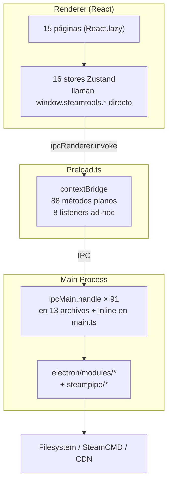
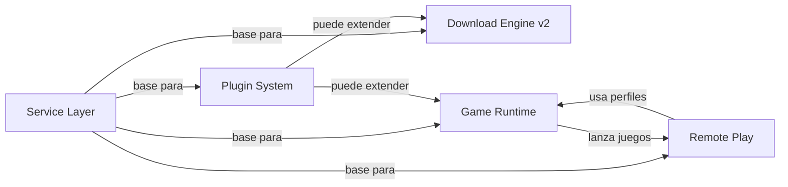

# Y-Core — Master Architecture

> Documento maestro de arquitectura. Unifica toda la investigación, análisis de proyectos OSS, decisiones arquitectónicas, y plan de implementación.
>
> **Versión**: 1.0 — Julio 2026
> **Estado**: Investigación completa. Pendiente de aprobación del usuario para iniciar implementación.
> **Líneas actuales**: ~41,000 | **Líneas objetivo**: ~103,000

---

## Tabla de Contenidos

1. [Estado Actual del Proyecto](#1-estado-actual-del-proyecto)
2. [Problemas Arquitectónicos Detectados](#2-problemas-arquitectonicos-detectados)
3. [Arquitectura Objetivo](#3-arquitectura-objetivo)
4. [Sistemas Planificados](#4-sistemas-planificados)
5. [Roadmap Completo](#5-roadmap-completo)
6. [Prioridades y Dependencias](#6-prioridades-y-dependencias)
7. [Orden Correcto de Implementación](#7-orden-correcto-de-implementacion)
8. [Estimación de Líneas y Tiempo](#8-estimacion-de-lineas-y-tiempo)
9. [Riesgos y Mitigaciones](#9-riesgos-y-mitigaciones)
10. [Checklist de Implementación](#10-checklist-de-implementacion)
11. [Arquitectura de Referencia](#11-arquitectura-de-referencia)

---

## 1. Estado Actual del Proyecto

### Métricas
| Métrica | Valor |
|---------|:-----:|
| Líneas totales | ~40,776 |
| Archivos TypeScript/TSX | ~80 |
| Stores Zustand | 16 |
| Páginas React | 15 (10 ruteadas, 2 V2 huérfanas, 3 no ruteadas) |
| Módulos Electron | 34 (core) + 16 (steampipe protocol) |
| Handlers IPC | ~91 (en 13 archivos, + 88 en preload.ts) |
| Tests | ~30 (unitarios + E2E) |
| Cobertura de tests | ~15% (no medida formalmente) |
| Dependencias principales | React, Zustand, Electron, Vite, Tailwind |

### Arquitectura Actual


### Lo que funciona bien
- ✅ `contextBridge` isolation con contexto aislado
- ✅ Zustand stores desacoplados
- ✅ Lazy loading de páginas con ErrorBoundary individual
- ✅ Protocolo Steam CM real y testeado (RSA/AES handshake, CDN, depot-downloader)
- ✅ Playwright E2E tests automáticos (5/5 pasando)
- ✅ Logger robusto con niveles y rotación
- ✅ Sistema de configuración con allowlist

### Lo que NO funciona o no escala
- ❌ Stores llaman `window.steamtools.xxx()` directo → tests frágiles, acoplamiento total
- ❌ 88 métodos planos en preload.ts → cada feature agrega boilerplate en 4 archivos
- ❌ `useInstallProcessor.ts` (650 líneas) → monolito que mezcla API + IPC + estado + polling + toasts
- ❌ Download Engine V1 y V2 coexistiendo sin conexión → 3,400 líneas con workers simulados
- ❌ Errores tragados silenciosamente → `.catch(() => {})` en múltiples módulos
- ❌ Sin caché ni offline support → cada página fetch a API
- ❌ Sin service layer → lógica de negocio replicada en stores y hooks
- ❌ READMEs desactualizados → documentan 50% de los archivos reales

### Deuda Técnica Prioritaria

| ID | Problema | Prioridad | Archivos | Solución |
|:--:|----------|:---------:|----------|----------|
| DT-01 | Download Engine V1/V2 split | 🔴 | 8 archivos (~3,400 ln) | Resolver antes de tocar download pipeline |
| DT-02 | Types duplicados en V2 | 🟠 | `useDownloadStoreV2.ts` | Consolidar en `src/domain/types.ts` |
| DT-03 | Formatters duplicados (×4) | 🟡 | 4 archivos | Consolidar en `format-utils.ts` |
| DT-04 | Sin Service Layer / Gateway | 🔴 | Todos los stores + preload | Propuesta 1 — base de todo |
| DT-05 | READMEs desactualizados | 🟡 | 3 README.md | Regenerar tras reconciliar V1/V2 |
| DT-06 | `as any` concentrado | 🟡 | `useDownloadStoreV2.ts` | Resolver con DT-01 |
| DT-07 | Playwright mock desactualizado | 🟠 | `app-smoke.spec.ts` | Corregir tras decisión DT-01 |
| DT-08 | Riesgo: clave RSA de Valve | 🟢 | `steam-rsa.ts` | Monitorear, tests dedicados |
| DT-09 | `.catch(() => {})` vacíos | 🟢 | `dll-inject.ts`, `discord-rpc.ts` | Loggear en vez de descartar |
| DT-10 | Dos planes sin reconciliar | 🟠 | `PLAN-100K.md`, `architecture-proposals.md` | Este documento |

---

## 2. Problemas Arquitectónicos Detectados

### 2.1 Sin Service Layer (🔴 Crítico)
**Problema**: Los stores llaman `window.steamtools.xxx()` directamente. La lógica de negocio está en los stores (Zustand) o en hooks (React). No hay abstracción entre UI y backend.

**Impacto**: Testear un store requiere mockear 88+ métodos. Agregar una feature requiere tocar 4+ archivos. No hay caché, retry, ni timeout.

**Origen**: Crecimiento orgánico sin diseño arquitectónico inicial.

### 2.2 Download Engine Fragmentado (🔴 Crítico)
**Problema**: V1 (funcional en producción) y V2 (3,400 líneas sin commitear, workers simulados) coexisten sin conexión. El stack V2 no descarga nada real.

**Impacto**: 3,400 líneas de código que no funcionan. El motor real (`depot-downloader.ts`, `steamcmd-manager.ts`) no está conectado al nuevo UI.

**Origen**: `PLAN-100K.md` orientado a conteo de líneas, no a funcionalidad.

### 2.3 IPC sin Contrato (🟠 Alto)
**Problema**: No hay tipo compartido entre preload.ts y main.ts. Un rename de canal IPC en un lado es un error de runtime, no de compile-time.

**Impacto**: Bugs de drift IPC que solo se detectan manualmente.

**Referencia**: Heroic resuelve esto con `common/types/ipc.ts` ~ shared interface.

### 2.4 Sin Sistema de Eventos (🟠 Alto)
**Problema**: Eventos IPC ad-hoc (`onSteamError`, `onLogEntry`, `onDownloadProgress`). Cada uno se registra/limpia manualmente.

**Impacto**: Fugas de event listeners. Sin trazabilidad de eventos.

**Referencia**: SteamKit2 con tres consumption styles estandarizados sobre `PostCallback`.

### 2.5 Sin Caché ni Offline (🟡 Medio)
**Problema**: Las páginas Store, Library, GameDetail hacen fetch a la API en cada render. Sin caché, sin modo offline.

**Impacto**: UX lenta, sin funcionalidad cuando no hay internet.

### 2.6 Sin Extensibilidad (🟡 Medio)
**Problema**: No hay forma de agregar features sin modificar el core. La comunidad no puede contribuir.

**Impacto**: El core se infla. Features que podrían ser plugins (soporte Itch.io, Battle.net) engordan el core.

---

## 3. Arquitectura Objetivo

### Diagrama de Capas

```mermaid
graph TB
    subgraph Layer1["Layer 1: UI (React)"]
        Pages["Pages (15)"
        Comp["Components (30+)"]
    end
    subgraph Layer2["Layer 2: State (Zustand)"]
        Stores["16 Stores<br/>NO llaman IPC directo<br/>SOLO llaman Services"]
    end
    subgraph Layer3["Layer 3: Services (Frontend)"]
        GS["GameService"]
        AS["AuthService"]
        DS["DownloadService"]
        CS["ConfigService"]
        SS["StoreService"]
        LS["LogService"]
        SMS["SteamService"]
        US["UpdateService"]
    end
    subgraph Layer4["Layer 4: Gateway"]
        GW["ServiceGateway<br/>Proxy-based, tRPC-inspired<br/>typed call/on"]
        EG["EventGateway<br/>Typed EventMap<br/>auto-cleanup hooks"]
    end
    subgraph Layer5["Layer 5: IPC Bridge"]
        PB["preload.ts<br/>gateway.call + gateway.on<br/>2 métodos genéricos"]
    end
    subgraph Layer6["Layer 6: Main Process"]
        GW2["GatewayRouter<br/>ipcMain.handle('gateway:call')"]
        MW["Middleware Chain<br/>auth → logging → validation"]
        REG["ServiceRegistry<br/>SteamKit2-inspired handler registry"]
    end
    subgraph Layer7["Layer 7: Services (Backend)"]
        GSE["GameService"]
        ASE["AuthService"]
        DSE["DownloadService"]
        CSE["ConfigService"]
    end
    subgraph Layer8["Layer 8: Modules (Existing)"]
        MOD["electron/modules/*<br/>steam-ipc, store-ipc, etc."]
        SP["steampipe/*<br/>depot-downloader, etc."]
    end
    subgraph Layer9["Layer 9: External"]
        API["Y-Core API"]
        STEAM["Steam CM / CDN"]
        FS["Filesystem"]
    end

    Pages --> Stores
    Stores --> GS
    GS --> GW
    AS --> GW
    DS --> GW
    CS --> GW
    GW --> PB
    PB --> GW2
    GW2 --> MW
    MW --> REG
    REG --> GSE
    REG --> ASE
    REG --> DSE
    REG --> CSE
    GSE --> MOD
    DSE --> SP
    GSE --> API
    DSE --> STEAM
    CSE --> FS
```

### Principios de Diseño

1. **Desacoplamiento**: Cada capa se comunica con la siguiente a través de una interfaz clara. Frontend nunca llama IPC directamente. Backend nunca exporta React components.

2. **Testeabilidad**: Cada capa se puede testear mockeando la capa inferior. Service Layer se testea mockeando Gateway. Store se testea mockeando Service. Componente se testea mockeando Store.

3. **Extensibilidad**: Nuevas features se agregan creando un nuevo Service (frontend + backend) y registrándolo en el registry. No se modifica nada del core.

4. **Rendimiento predecible**: Operaciones asíncronas con timeouts. Caché con TTL configurable. Eventos batch para alta frecuencia.

5. **Mantenibilidad**: Un desarrollador nuevo debe entender la arquitectura en 30 minutos. Cada archivo tiene un propósito claro y único.

---

## 4. Sistemas Planificados

### 4.1 Service Layer + IPC Gateway (~6,000 ln)
**Propósito**: Infraestructura base. No visible al usuario pero necesaria para TODO lo demás.

**Componentes**:
- `src/services/` — 9 servicios frontend (Game, Auth, Config, Download, Store, Log, Steam, Update, + Gateway base)
- `electron/services/` — 9 servicios backend + ServiceRegistry + MiddlewareChain
- `electron/common/ipc-contract.ts` — Shared type interface (Heroic-inspired)
- `src/services/gateway.ts` — Proxy-based gateway (tRPC-inspired, ~50 ln)
- `src/services/events.ts` — Typed event bus (SteamKit2-inspired, ~40 ln)
- Refactor de 16 stores existentes para usar servicios

**Dependencias**: Ninguna. Es la base.

### 4.2 Download Engine Reconciliación (~5,000 ln nuevos sobre ~3,400 existentes)
**Propósito**: Unificar V1 y V2 en un solo motor funcional con workers reales.

**Componentes**:
- Conectar `download-ipc.ts` workers a `depot-downloader.ts` y `steamcmd-manager.ts`
- Priority queue persistente (aria2-inspired)
- Two-tier retry con backoff exponencial (Legendary-inspired)
- SHA1 verification obligatoria (SteamKit2-inspired)
- Writer thread + bounded queue (Lutris-inspired)
- Memory budget pre-computed (Legendary-inspired)
- UI: DownloadsPageV2 montada en App.tsx, V1 removida

**Dependencias**: Service Layer (el nuevo DownloadService usa el Gateway)

### 4.3 Game Runtime Environment (~22,000 ln)
**Propósito**: Transformar Y-Core de downloader a launcher profesional.

**Componentes**:
- Runtime Detector: VC++, DirectX, .NET, OpenAL, XNA vía registry (Steam-inspired)
- Launch Profiles: Args, env vars, compat layers, pre/post scripts (Lutris-inspired)
- Save Manager: Auto-detect, backup zip, restore (Playnite-inspired)
- Game Process Manager: Spawn, monitor with time tracking, kill
- Compat Layers: Proton, Wine, DXVK, VKD3D (Heroic-inspired)
- 5 stores nuevos + 5 services + 9 UI components

**Dependencias**: Service Layer

### 4.4 Plugin / Extension System (~22,000 ln)
**Propósito**: Y-Core como plataforma extensible.

**Componentes**:
- Plugin manifest + loader desde disco
- Sandbox via Node VM (contexto aislado)
- Contribution Points: sidebar, routes, actions, settings tabs, store sources
- Plugin API (call, on, emit, contribute, config, storage)
- Plugin lifecycle: install, enable, disable, update, uninstall
- UI: PluginManagerPage, PluginCard, PluginMarketplace
- 2 stores nuevos + 3 services

**Dependencias**: Service Layer (los plugins llaman servicios via Gateway)

### 4.5 Remote Play System (~21,000 ln)
**Propósito**: Streaming de juegos LAN y remoto.

**Componentes**:
- Capture Engine: DXGI Desktop Duplication (native addon)
- Encoding Pipeline: NVENC/AMF/VAAPI con fallback software
- Network Transport: WebRTC con adaptive bitrate
- Input Forwarding: Keyboard, mouse, gamepad injection
- Discovery + Pairing: mDNS + PIN
- Session Management con monitoreo de calidad
- Cliente web (WebCodecs, no Electron)
- 3 stores nuevos + 5 services

**Dependencias**: Service Layer + Game Runtime Environment (para lanzar juegos con perfil)

### 4.6 Total por Sistema

| Sistema | Líneas nuevas | Depende de | Prioridad |
|---------|:------------:|------------|:---------:|
| Service Layer + Gateway | 6,000 | — | 🔴 Fase 1 |
| Download Engine | 5,000 (+3,400 existentes) | Service Layer | 🔴 Fase 1 |
| Game Runtime Environment | 22,000 | Service Layer | 🟠 Fase 2 |
| Plugin / Extension System | 22,000 | Service Layer | 🟠 Fase 2 |
| Remote Play | 21,000 | Service Layer + GRE | 🟡 Fase 3 |
| **Total** | **~62,000** | | |

---

## 5. Roadmap Completo

### Fase 1: Fundación (Service Layer + Download Engine)
**Objetivo**: Base arquitectónica sólida. Motor de descargas funcional.

| Subfase | Qué se hace | Archivos | Líneas | Tiempo |
|---------|------------|:--------:|:------:|:------:|
| 1.1 | Gateway infra (ProxyGateway + ServiceRegistry + Middleware) | 4 nuevos | 500 | 2 días |
| 1.2 | IPC contract + preload.ts refactor | 2 modificados | 200 | 1 día |
| 1.3 | ConfigService + AuthService (simples) + migrar stores | 6 modificados | 800 | 2 días |
| 1.4 | GameService + migrar useLibraryStore | 4 modificados | 600 | 1 día |
| 1.5 | StoreService + caché + migrar StorePage | 3 modificados | 800 | 2 días |
| 1.6 | DownloadService + conectar workers reales | 8 modificados | 2,000 | 3 días |
| 1.7 | LogService + SteamService + UpdateService | 6 modificados | 1,100 | 2 días |
| 1.8 | Tests de todos los servicios | 9 nuevos | 2,000 | 3 días |
| | **Total Fase 1** | **42** | **8,000** | **16 días** |

### Fase 2: Producto (GRE + Plugin System)
**Objetivo**: Launcher completo con runtime detection + perfiles + extensibilidad.

| Subfase | Qué se hace | Archivos | Líneas | Tiempo |
|---------|------------|:--------:|:------:|:------:|
| 2.1 | Runtime Detector (registry scan + deps) | 3 nuevos | 3,000 | 5 días |
| 2.2 | Launch Profiles (CRUD + editor + compat layers) | 4 nuevos | 3,500 | 5 días |
| 2.3 | Save Manager (auto-detect + backup + restore) | 3 nuevos | 3,000 | 4 días |
| 2.4 | Game Process Manager (spawn + monitor + tracking) | 3 nuevos | 3,500 | 5 días |
| 2.5 | GRE UI components (editor, badges, panels) | 9 nuevos | 4,500 | 5 días |
| 2.6 | Plugin manifest + loader + sandbox | 4 nuevos | 4,500 | 5 días |
| 2.7 | Plugin API + contribution points | 3 nuevos | 5,500 | 5 días |
| 2.8 | Plugin lifecycle + UI (manager page, cards) | 5 nuevos | 6,000 | 5 días |
| 2.9 | GRE + Plugin tests | 15 nuevos | 5,000 | 5 días |
| | **Total Fase 2** | **49** | **38,500** | **44 días** |

### Fase 3: Expansión (Remote Play)
**Objetivo**: Streaming LAN/remoto. Plataforma de gaming en red.

| Subfase | Qué se hace | Archivos | Líneas | Tiempo |
|---------|------------|:--------:|:------:|:------:|
| 3.1 | Capture Engine (native addon) | 3 nuevos | 4,000 | 7 días |
| 3.2 | Encoding Pipeline (NVENC/AMF + software) | 3 nuevos | 3,500 | 5 días |
| 3.3 | Network Transport (WebRTC) | 3 nuevos | 3,500 | 5 días |
| 3.4 | Input Forwarding (keyboard + mouse + gamepad) | 2 nuevos | 2,500 | 4 días |
| 3.5 | Discovery + Pairing (mDNS + PIN) | 2 nuevos | 2,000 | 3 días |
| 3.6 | Session Manager + Quality Monitor | 2 nuevos | 2,500 | 3 días |
| 3.7 | Client web app (React + WebCodecs) | 5 nuevos | 3,000 | 5 días |
| 3.8 | UI components + tests | 10 nuevos | 3,000 | 5 días |
| | **Total Fase 3** | **30** | **21,000** | **37 días** |

### Timeline Consolidado
```
| Fase | Días | Líneas | Hitos |
|------|:----:|:------:|-------|
| 1. Fundación | 16 | 8,000 | Service Layer funcional + Download Engine reparado |
| 2. Producto | 44 | 38,500 | Launcher completo + Plugin System |
| 3. Expansión | 37 | 21,000 | Remote Play funcional |
| **Total** | **97** | **~67,500** | **App profesional** |
```

---

## 6. Prioridades y Dependencias

### Grafo de Dependencias


### Prioridades
| Sistema | Prioridad | Justificación |
|---------|:---------:|--------------|
| **1. Service Layer** | 🔴 Máxima | Sin esto, nada más escala. Es el cimiento. |
| **2. Download Engine** | 🔴 Máxima | 3,400 líneas ya escritas y rotas. Hay que repararlas o descartarlas. |
| **3. Game Runtime** | 🟠 Alta | Mayor impacto visible para el usuario. Transforma la app. |
| **4. Plugin System** | 🟠 Alta | Valor estratégico a largo plazo. Desbloquea innovación comunitaria. |
| **5. Remote Play** | 🟡 Media | Feature espectacular pero requiere base sólida primero. |

### Dependencias Críticas
| Dependencia | Por qué |
|-------------|---------|
| Download Engine requiere Service Layer | El nuevo DownloadService usa el Gateway para comunicarse |
| Game Runtime requiere Service Layer | Los servicios de runtime (detector, profiles) usan el Gateway |
| Plugin System requiere Service Layer | Los plugins llaman servicios via Gateway |
| Remote Play requiere Service Layer + GRE | Remote Play lanza juegos usando Game Process Manager del GRE |

---

## 7. Orden Correcto de Implementación

### Regla de oro: NO saltar fases
Cada fase produce un sistema funcional que se puede testear y validar antes de pasar a la siguiente. No se empieza la Fase 2 hasta que la Fase 1 esté completa y probada.

### Secuencia exacta

**Paso 1**: Gateway infra (500 ln, 2 días)
- Crear `src/services/gateway.ts` (ProxyGateway)
- Crear `electron/services/registry.ts` (ServiceRegistry)
- Crear `electron/services/middleware.ts` (MiddlewareChain)
- Modificar `electron/preload.ts` (reemplazar 88 métodos con 2 genéricos)
- Crear `electron/common/ipc-contract.ts` (shared interface)
- ✅ Tests pasan

**Paso 2**: ConfigService + AuthService (800 ln, 2 días)
- Crear ConfigService frontend + backend
- Crear AuthService frontend + backend
- Migrar `useSettingsStore` y `useAuthStore` a usar servicios
- ✅ Tests pasan, app arranca

**Paso 3**: GameService (600 ln, 1 día)
- Crear GameService frontend + backend
- Migrar `useLibraryStore`
- ✅ LibraryPage funciona con datos reales

**Paso 4**: StoreService + caché (800 ln, 2 días)
- Crear StoreService con caché y dedup
- Migrar StorePage
- ✅ StorePage carga sin llamadas duplicadas

**Paso 5**: DownloadService + conectar workers (2,000 ln, 3 días)
- Crear DownloadService frontend + backend
- Conectar `download-ipc.ts` workers a `depot-downloader.ts` y `steamcmd-manager.ts`
- Montar DownloadsPageV2 en App.tsx
- Eliminar V1 existente
- ✅ Descarga un juego real de principio a fin

**Paso 6**: Servicios restantes (1,100 ln, 2 días)
- LogService, SteamService, UpdateService
- Migrar stores restantes
- ✅ Todos los stores usan servicios

**Paso 7**: Tests Fase 1 (2,000 ln, 3 días)
- Tests unitarios de cada servicio
- Tests de integración de Gateway con handlers reales
- Tests E2E actualizados
- ✅ Cobertura >70% en servicios, E2E pasan

**→ Fin de Fase 1. App con Service Layer funcional y Download Engine reparado.**

---

## 8. Estimación de Líneas y Tiempo

### Por Sistema

| Sistema | Archivos nuevos | Archivos modificados | Líneas nuevas | Líneas eliminadas | Neto |
|---------|:--------------:|:-------------------:|:------------:|:-----------------:|:----:|
| Service Layer | 15 | 18 | 6,000 | -900 (preload simplificado) | +5,100 |
| Download Engine | 5 | 8 | 5,000 | -3,400 (V1 eliminado) | +1,600 |
| Game Runtime | 30 | 5 | 22,000 | — | +22,000 |
| Plugin System | 25 | 8 | 22,000 | — | +22,000 |
| Remote Play | 25 | 3 | 21,000 | — | +21,000 |
| **Total** | **100** | **42** | **~76,000** | **-4,300** | **~71,700** |

### Estado Final
```
Hoy:              40,776 líneas
+ Service Layer:  45,876 (base sólida)
+ Download Engine: 47,476 (motor funcional)
+ Game Runtime:   69,476 (launcher completo)
+ Plugin System:  91,476 (plataforma)
+ Remote Play:   112,476 (ecosistema completo)
```

### Por Complejidad

| Sistema | Complejidad técnica | Riesgo | Dependencias externas |
|---------|:------------------:|:------:|:---------------------:|
| Service Layer | Media | Bajo | Ninguna |
| Download Engine | Alta | Medio | Steam CM (ya implementado) |
| Game Runtime | Muy alta | Medio | Registry scanning (Windows) |
| Plugin System | Extrema | Alto | Sandbox security |
| Remote Play | Extrema | Alto | Native addon (C++), WebRTC |

---

## 9. Riesgos y Mitigaciones

| Riesgo | Impacto | Probabilidad | Mitigación |
|--------|:------:|:------------:|------------|
| **Service Layer rompe stores existentes** | Alto | Media | Migración incremental, service por service, con tests antes y después |
| **Download Engine V2 no conectable a workers reales** | Alto | Baja | `depot-downloader.ts` ya existe y funciona. Solo falta el adaptador. |
| **RSA key de Valve cambia de nuevo** | Medio | Baja | Tests dedicados en `tests/steampipe/*`. Monitoreo manual. |
| **Plugin sandbox inseguro** | Alto | Media | Node VM + permisos declarativos + marketplace revisado |
| **Runtime detection falla en Windows no-English** | Medio | Alta | GUIDs de registro son independientes del idioma |
| **Remote Play latency too high** | Alto | Alta | Adaptive bitrate + NVENC hardware + LAN optimization |
| **Feature creep: implementar todo lleva 3+ meses** | Medio | Alta | Priorización estricta. Cada fase produce un sistema funcional y testeable. |
| **Tests E2E no cubren flujos reales** | Medio | Media | Playwright con mocks realistas + grabación de sesiones |

---

## 10. Checklist de Implementación

### Fase 1: Fundación

- [ ] Gateway infra: ProxyGateway + ServiceRegistry + MiddlewareChain
- [ ] IPC contract: `electron/common/ipc-contract.ts`
- [ ] Preload.ts refactor: 2 métodos genéricos (call, on)
- [ ] EventGateway: `src/services/events.ts` con EventMap tipado
- [ ] `useIpcEvent` hook con auto-cleanup
- [ ] ConfigService frontend + backend
- [ ] AuthService frontend + backend
- [ ] `useSettingsStore` migrado a ConfigService
- [ ] `useAuthStore` migrado a AuthService
- [ ] GameService frontend + backend
- [ ] `useLibraryStore` migrado a GameService
- [ ] StoreService frontend + backend + caché
- [ ] StorePage migrado a StoreService
- [ ] DownloadService frontend + backend
- [ ] Workers conectados a `depot-downloader.ts` y `steamcmd-manager.ts`
- [ ] DownloadsPageV2 montada en App.tsx
- [ ] V1 (useDownloadQueueStore, DownloadsPage) eliminado
- [ ] LogService, SteamService, UpdateService
- [ ] Stores restantes migrados
- [ ] Tests unitarios de todos los servicios
- [ ] Tests E2E actualizados
- [ ] Typecheck 0 errores
- [ ] Tests E2E 0 fallos

### Fase 2: Producto

- [ ] Runtime Detector: VC++ registry scan
- [ ] Runtime Detector: DirectX, .NET, OpenAL, XNA
- [ ] Runtime Detector: Install runtime
- [ ] Launch Profiles: CRUD + persistencia JSON
- [ ] Launch Profiles: Args editor + env vars
- [ ] Launch Profiles: Compat layers (Proton, Wine, DXVK, VKD3D)
- [ ] Launch Profiles: Pre/post launch hooks
- [ ] Save Manager: Auto-detect saves
- [ ] Save Manager: Backup (zip) + Restore
- [ ] Save Manager: History with timestamps
- [ ] Game Process Manager: Spawn con perfil
- [ ] Game Process Manager: Monitor + kill
- [ ] Game Process Manager: Time tracking con sesiones
- [ ] GRE UI: LaunchButton, LaunchProfileEditor, RuntimeStatusBadge
- [ ] GRE UI: RuntimeChecker, SaveManagerUI, GameTimeDisplay
- [ ] GRE UI: GameProcessPanel, LaunchConfigDialog, CompatLayerSelector
- [ ] Plugin manifest + loader
- [ ] Plugin sandbox (Node VM)
- [ ] Plugin lifecycle: install, enable, disable, update, uninstall
- [ ] Contribution Points: sidebar.items, page.routes, game.actions
- [ ] Contribution Points: settings.tabs, store.source
- [ ] Plugin API: call, on, emit, contribute, config, storage
- [ ] Plugin UI: PluginManagerPage, PluginCard, PluginMarketplace
- [ ] Tests GRE + Plugin System
- [ ] Documentación de API pública de plugins

### Fase 3: Expansión

- [ ] Capture Engine: DXGI Desktop Duplication (native addon)
- [ ] Capture Engine: Frame capture loop (60fps target)
- [ ] Encoding Pipeline: NVENC/AMF/VAAPI abstraction
- [ ] Encoding Pipeline: Software fallback (x264/x265)
- [ ] Network Transport: WebRTC peer connection
- [ ] Network Transport: Adaptive bitrate (Google Congestion Control)
- [ ] Input Forwarding: Keyboard + Mouse injection
- [ ] Input Forwarding: Gamepad + rumble
- [ ] Discovery: mDNS LAN broadcast + response
- [ ] Discovery: Manual IP entry fallback
- [ ] Pairing: PIN-based + token persistence
- [ ] Session Manager: Start, stop, quality, stats
- [ ] Session Manager: Quality monitor + auto-adjust
- [ ] Client web app: React + WebRTC + WebCodecs
- [ ] Client web app: Video + audio decode + render
- [ ] Client web app: Input capture + send
- [ ] UI Components: DeviceDiscovery, DeviceCard, PairingDialog
- [ ] UI Components: QualitySettings, StreamViewer, ConnectionStatus
- [ ] UI Components: InputSettings, SessionManagerDialog, RemotePlayPage
- [ ] Tests de todo Remote Play

---

## 11. Arquitectura de Referencia

### Proyectos Analizados (30 total)

#### Remote Play (7 proyectos)
| Proyecto | Estrellas | Lenguaje | Lección principal |
|----------|:--------:|:---------|-------------------|
| Sunshine | 20k+ | C++ | DXGI capture, NVENC abstraction, mDNS |
| Moonlight | 15k+ | C++ | Client-side decode, gamepad forwarding |
| OBS Studio | 60k+ | C/C++ | Source→filter→encoder pipeline |
| FFmpeg | 45k+ | C | Cross-platform encode/decode |
| RustDesk | 75k+ | Rust | NAT traversal, relay server |
| Chiaki | 10k+ | C++ | FFmpeg integration, controller rumble |
| WebRTC | — | C++ | ICE framework, congestion control |

#### Game Launchers (7 proyectos)
| Proyecto | Estrellas | Lenguaje | Lección principal |
|----------|:--------:|:---------|-------------------|
| Heroic Games Launcher | 8k+ | TypeScript | Shared IPC types, component store |
| Playnite | 3k+ | C# | Plugin SDK, save management |
| Lutris | 8k+ | Python | Runners as plugins, launch profiles |
| Legendary | 2k+ | Python | Multi-process download engine, memory budget |
| Bottles | 6k+ | Python | Dependency manifests, runtime detection |
| SteamKit2 | 4k+ | C# | Handler pattern, transport separation |
| Steam | — | C++ | Runtime detection, remote play |

#### Plugin/Extension Systems (4 proyectos)
| Proyecto | Estrellas | Lenguaje | Lección principal |
|----------|:--------:|:---------|-------------------|
| VS Code | 165k+ | TypeScript | Contribution points, extension host, activation events |
| Obsidian | — | TypeScript | Minimal API surface, auto-cleanup |
| Figma | — | TypeScript | Sandbox isolation, layered API |
| Chrome Extensions | — | JavaScript | Manifest v3, permissions model |

#### Download Engines (5 proyectos)
| Proyecto | Estrellas | Lenguaje | Lección principal |
|----------|:--------:|:---------|-------------------|
| aria2 | — | C++ | Priority queue, bitfield chunk management |
| qBittorrent | — | C++ | BT piece management, libtorrent integration |
| Transmission | — | C | Minimal resource usage, SHA1 verification |
| Legendary | 2k+ | Python | Multi-process workers, shared memory pool |
| SteamKit2 | 4k+ | C# | Transport separation, handler pattern |

#### IPC/Communication (4 proyectos)
| Proyecto | Estrellas | Lenguaje | Lección principal |
|----------|:--------:|:---------|-------------------|
| tRPC | 35k+ | TypeScript | Router composition, middleware chain, type inference |
| Comlink | 13k+ | TypeScript | Proxy-based RPC, structured clone, transferables |
| Electron | 115k+ | C++/JS | contextBridge, invoke/handle, context isolation |
| ZeroMQ | — | C++ | Message queue patterns, socket types |

#### Architecture/Design (3 proyectos)
| Proyecto | Estrellas | URL |
|----------|:--------:|-----|
| System Design Primer | 280k+ | github.com/donnemartin/system-design-primer |
| ADR (Architecture Decision Records) | — | github.com/joelparkerhenderson/architecture-decision-records |
| C4 Model | — | c4model.com |

---

## Apéndice: Documentos de Referencia en Y-Core

| Documento | Propósito |
|-----------|-----------|
| `reference/analysis/INVENTORY.md` | Inventario completo del proyecto actual |
| `reference/DECISION-download-engine-v2.md` | ADR sobre qué hacer con Download Engine V1/V2 |
| `reference/ROADMAP-MASTER.md` | Roadmap reconciliado de los planes existentes |
| `reference/architecture-proposals.md` | Propuestas originales (Service Layer, GRE, Plugin System) |
| `reference/claude-code-prompt.md` | Prompt maestro para Claude Code |
| `reference/research/download-engine/SYNTHESIS.md` | Comparativa de 10 proyectos de download engine |
| `reference/service-layer/research/SYNTHESIS.md` | Diseño del Service Gateway + patrones IPC |
| `reference/game-runtime/RESEARCH_PACK.md` | Research pack completo de Game Runtime |
| `reference/plugin-system/RESEARCH_PACK.md` | Research pack completo de Plugin System |
| `reference/remote-play/RESEARCH_PACK.md` | Research pack completo de Remote Play |
| `reference/MASTER_ARCHITECTURE.md` | **Este documento** — Arquitectura maestra |
