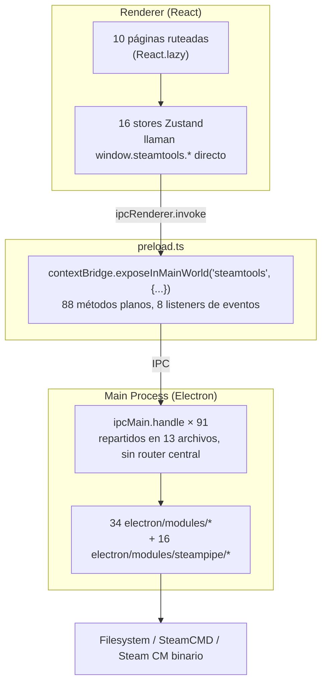
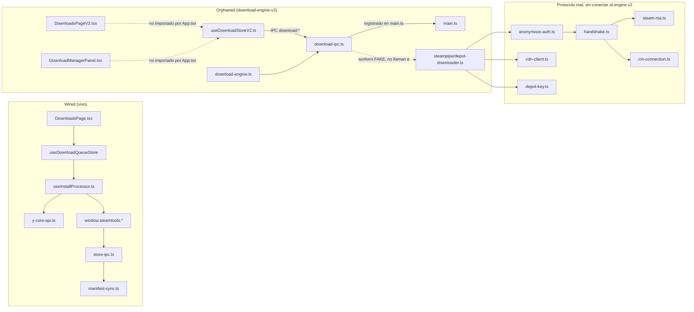

# Y-Core — Inventario Completo del Proyecto

> Generado: 2026-07-24. Cubre el estado del repositorio incluyendo cambios sin commitear.

---

## 1. Resumen Ejecutivo

Y-Core es una aplicación Electron + React + TypeScript para gestión de juegos de Steam (~56,500 líneas antes de los cambios en curso). La arquitectura actual separa limpiamente proceso principal y renderer vía IPC, usa 16 stores Zustand razonablemente encapsulados, lazy-loading de páginas, y cada ruta está envuelta en su propio `ErrorBoundary`. El proyecto además contiene una implementación de bajo nivel del protocolo binario de Steam (Connection Manager: RSA handshake, sesión AES, descubrimiento de CDN) que es trabajo genuino y testeado, no boilerplate.

La debilidad estructural principal, ya diagnosticada en `reference/architecture-proposals.md`, es la ausencia total de una capa de servicios: los 16 stores llaman `window.steamtools.xxx()` directamente, y `preload.ts` expone 88 métodos planos sin gateway ni validación. Esto hace que cada feature nueva toque mínimo 4 archivos (preload + main + store + hook) y que testear un store requiera mockear las 88 superficies del bridge completo.

El hallazgo más urgente de este análisis, sin embargo, es nuevo: hay ~3,400 líneas sin commitear de un "Download Engine v2" (motor de colas/reintentos/SHA1 real) cuyos workers de descarga están **simulados con `setTimeout`** — no descargan nada real — y que no está montado en la UI en absoluto. Coexiste con un stack V1 completamente funcional cuyo propio comentario de cabecera lo describe como "la única superficie de progreso de descargas de la app", escrito sin conciencia de que V2 existe. Este split V1/V2 es la prioridad de reconciliación más inmediata, por delante incluso del Service Layer.

## 2. Arquitectura Actual

No existe `src/services/` ni `electron/services/` — la propuesta de Service Layer + Gateway (ver `reference/architecture-proposals.md`) es 0% implementada.

## 3. Inventario de Archivos

### 3.1 Entry points

| Ruta | Propósito | Líneas | Calidad | Deuda | Acción |
|---|---|---:|---|---|---|
| `electron/main.ts` | Bootstrap Electron: crash handlers, single-instance, registra 12 módulos IPC + 91 handlers propios inline (SteamCMD, updater) | 555 | Media | Mezcla registro modular con handlers inline; sin service registry | Extraer handlers inline a módulos al construir Service Layer |
| `electron/preload.ts` | `contextBridge` único con 88 métodos planos + 8 listeners | 237 | Media | Sin gateway/schema; boilerplate por feature | Reemplazar por `gateway.call()` (Propuesta 1) |
| `src/main.tsx` | Entry React: mock steamtools en dev, tema, locale, monta `App` | 53 | Alta | — | Ninguna |
| `src/App.tsx` | Router central, 10 páginas lazy, cada ruta con `ErrorBoundary` propio | 122 | Alta | DownloadManagerPanel/DownloadNotification no importados | Ver §4 DT-01 |

### 3.2 `electron/modules/` (core)

| Ruta | Propósito | Líneas | Calidad | Deuda | Acción |
|---|---|---:|---|---|---|
| `config.ts` | Config con `ALLOWED_CONFIG_KEYS` allowlist | 129 | Alta | — | No |
| `auth-ipc.ts` | Auth solo-username, persiste `ycore-username.json` | 106 | Alta | — | No |
| `steam-ipc.ts` | Legacy: listar/lanzar/desinstalar/verificar juegos, import Lua/manifest | 620 | Media | Archivo grande (>500 ln) | Dividir al migrar a Service Layer |
| `store-ipc.ts` | Pipeline de instalación: depot keys → manifest sync → ACF | 254 | Media | — | No |
| `windows.ts` | Ventanas splash/login/main + tray | 441 | Alta | — | No |
| `ycore-native.ts` | FFI vía koffi a `ycore.dll`, fallback JS | 545 | Media | Archivo grande | Revisar al tocar native layer |
| `steamcmd-manager.ts` | Ciclo de vida de SteamCMD, cola con concurrencia, parsing stdout | 726 | Media | Archivo grande | Candidato a servicio real de descarga |
| `steamcmd-fetcher.ts` | Descarga/extracción del binario SteamCMD | 456 | Alta | — | No |
| `steamcmd-parser.ts` | Funciones puras de parsing | 85 | Alta | Único TODO del repo | Revisar TODO puntual |
| `steamcmd-types.ts` | Tipos compartidos SteamCMD | 64 | Alta | — | No |
| `manifest-sync.ts` | ACF watcher, mantiene manifests en estado "update required" | 551 | Media | Archivo grande | No urgente |
| `acf.ts` | Lectura/escritura de manifests ACF | 298 | Alta | — | No |
| `onlinefix.ts` | Feature Online Fix (compat DRM-crack) | 826 | Media | Archivo más grande de `modules/` | Dividir si se toca |
| `drm-remover.ts` / `drm-stub.ts` | IPC de remoción DRM + stub "no implementado" | 291 / 34 | Alta | — | No |
| `dll-inject.ts` | Inyección DLL nativa (OpenSteamTool) | 556 | Media | Archivo grande, 2 `.catch(()=>{})` | Revisar swallow de errores |
| `discord-rpc.ts` | Discord Rich Presence | 409 | Media | 2 `.catch(()=>{})` | Revisar swallow de errores |
| `goldsrc.ts` | Depots de mods GoldSrc | 189 | Alta | — | No |
| `local-steam-emulator.ts` | Emulación local de cliente Steam | 386 | Media | 1 `eslint-disable` | No urgente |
| `steam-helpers.ts` | Helpers compartidos de paths/appId | 329 | Alta | — | No |
| `steam-log-watcher.ts` | Tail de `console_log.txt`, emite `steam:error` | 176 | Alta | — | No |
| `store-images.ts` | Cache de imágenes SteamGridDB | 233 | Alta | — | No |
| `signature-cache.ts` / `signature-report.ts` | Cache/reporte de verificación de firmas | 105 / 164 | Alta | — | No |
| `steamspy-cache.ts` | Cache de stats SteamSpy | 54 | Alta | — | No |
| `depot-keys.ts` | Helpers de depot keys | 112 | Alta | 2 `console.*` | Menor |
| `logs.ts` | IPC de logs de la app | 48 | Alta | — | No |
| `electron-context.ts` | `emitToRenderers` y contexto compartido | 158 | Alta | 1 `eslint-disable` | No urgente |
| `lua.ts` | Re-export delgado | 6 | Alta | — | No |
| `types.ts` | Tipos compartidos del módulo | 15 | Alta | — | No |

### 3.3 `electron/modules/download-engine-v2/*` — **sin commitear, isla desconectada**

| Ruta | Propósito | Líneas | Calidad | Deuda | Acción |
|---|---|---:|---|---|---|
| `download-engine.ts` | Motor: cola de prioridad, `SpeedTracker`, `RetryManager`, verificación SHA1, persistencia a disco | 976 | Media (diseño sólido, ejecución fake) | Segundo archivo más grande del repo; sin tests | Ver §4 DT-01 |
| `download-engine-types.ts` | Tipos compartidos (`DownloadTask`, `DownloadState`, etc.) | 156 | Alta | Duplicado manualmente en `useDownloadStoreV2.ts` | Ver §4 DT-02 |
| `download-ipc.ts` | Registra 13 handlers `download:*`; `registerWorkers()` instala **4 workers simulados** (`setTimeout` incrementando bytes falsos) | 305 | Baja (funcionalidad simulada) | Ningún worker llama a `depot-downloader.ts` real ni a `steamcmd-manager.ts` | Ver §4 DT-01 — decisión requerida |
| `download-api-bridge.ts` | Traduce respuesta de `/install` de la API a tareas del engine | 165 | Media | No invocado por ningún flujo de UI vivo | Ver §4 DT-01 |

### 3.4 `electron/modules/steampipe/` — protocolo Steam CM (real, testeado)

| Ruta | Propósito | Líneas | Calidad | Deuda | Acción |
|---|---|---:|---|---|---|
| `cm-directory.ts` | Query a `IServiceDirectory` (protobuf) para lista de CM servers | 333 | Alta | — | No |
| `cm-connection.ts` *(modificado)* | Socket TCP crudo, framing pre/post-handshake, fix de magic `VT01` (Round-6) | 348 | Alta | Protocolo frágil por naturaleza | Mantener tests al día |
| `cm-protocol.ts` *(modificado)* | Encode/decode de `ChannelEncryptRequest/Response/Result` | 420 | Alta | — | No |
| `handshake.ts` *(modificado)* | Orquesta handshake de 3 mensajes, migrado de EMsg legacy 109/110/111 a moderno 1303/1304/1305 | 173 | Alta | — | No |
| `steam-rsa.ts` *(modificado)* | Clave pública RSA 1024-bit hardcodeada de Valve, RSA-OAEP-SHA1 | 86 | Alta | Riesgo: Valve puede rotar la clave de nuevo (ya ocurrió una vez, ver comentario in-file) | Documentar en Riesgos §7 |
| `aes-session.ts` | Sesión AES-256-CBC con IV cifrado por paquete | 127 | Alta | — | No |
| `anonymous-auth.ts` | Login anónimo `CMsgClientLogOn` | 146 | Alta | — | No |
| `cdn-client.ts` | Cliente HTTP CDN para manifests/chunks | 374 | Alta | — | No |
| `content-servers.ts` | Descubrimiento de servidores CDN | 200 | Alta | — | No |
| `depot-key.ts` | Obtención de clave de descifrado de depot | 113 | Alta | — | No |
| `depot-downloader.ts` | **Orquestador F2P completo y real**: auth → CDN → depot key → manifest → chunks → SHA1 | 459 | Alta | No es invocado por download-engine-v2 | Ver §4 DT-01 |
| `proto.ts` | Primitivas protobuf hand-rolled (varint/length-delimited) | 386 | Alta | — | No |
| `types.ts` | Tipos `CmServer` y afines | 195 | Alta | — | No |
| `zip-reader.ts` | Lector ZIP mínimo en memoria | 80 | Alta | — | No |
| `index.ts` | Orquestador + wiring IPC (`steampipe:probeAnonymous`, `steampipe:downloadDepot`) | 227 | Alta | — | No |

### 3.5 `src/stores/`

| Ruta | Propósito | Líneas | Calidad | Deuda | Acción |
|---|---|---:|---|---|---|
| `useAuthStore.ts` | Auth solo-username | 49 | Alta | — | No |
| `useCommandPaletteStore.ts` | Estado command palette | 15 | Alta | — | No |
| `useDownloadQueueStore.ts` | **V1 (vivo)**: cola FIFO simple, usado por `useInstallProcessor`, `DownloadsPage`, `StorePage`, `GameDetailPage`, `EpicSidebar` | 49 | Alta | — | No |
| `useDownloadStoreV2.ts` | **V2 (nuevo, huérfano)**: tasks/queue/history/filters, sincronizado con IPC `download:*` | 399 | Baja | 11/19 `as any` del repo están aquí; tipos duplicados manualmente | Ver §4 DT-01, DT-02 |
| `useErrorStore.ts` | Estado de diálogo de error global | 20 | Alta | — | No |
| `useLibraryStore.ts` *(modificado)* | Juegos instalados, Fuse.js fuzzy search, cache acotada (`_fuseCache`, máx 3) reemplazando ref sin límite | 137 | Alta | — | No — mejora de memoria ya aplicada |
| `useRecommendationStore.ts` | Recomendaciones en StorePage | 28 | Alta | — | No |
| `useSettingsStore.ts` | Tema, idioma, API keys, nav sidebar | 268 | Alta | — | No |
| `useSignaturePendingStore.ts` | Modal de firma pendiente | 35 | Alta | — | No |
| `useSteamCmdJobsStore.ts` | Jobs SteamCMD (progreso granular, separado deliberadamente de V1) | 106 | Alta | — | No |
| `useSteamErrorStore.ts` | Modal de error del log watcher | 22 | Alta | — | No |
| `useSteamStore.ts` *(modificado)* | Path/running/library folders; `init()` migrado de `Promise.all` a `Promise.allSettled` con `.catch()` por-llamada | 72 | Alta | — | No — fix de resiliencia ya aplicado |
| `useSupportChatStore.ts` | Widget de soporte | 13 | Alta | — | No |
| `useToastStore.ts` | Cola de toasts | 30 | Alta | — | No |
| `useTourStore.ts` | Onboarding tour | 43 | Alta | — | No |
| `README.md` | Documenta solo 7/16 stores | — | Baja | Desactualizado | Ver §4 DT-05 |

### 3.6 `src/pages/`

| Ruta | Ruta App.tsx | Propósito | Líneas | Acción |
|---|---|---|---:|---|
| `LibraryPage.tsx` | `/` | Grid de instalados | 531 | No |
| `StorePage.tsx` | `/store` | Store/búsqueda/instalar | 656 | No |
| `GameDetailPage.tsx` | `/store/:appId` | Detalle + instalar | 602 | No |
| `AddGame.tsx` | `/add-game` | Añadir manual vía Lua/depot-key | 510 | No |
| `ImportGame.tsx` | `/import-game` | Import por carpeta | 218 | No |
| `LogsPage.tsx` | `/logs` | Visor de logs | 266 | No |
| `OnlineFixPage.tsx` | `/online-fix` | Browser Online Fix | 400 | No |
| `DrmRemoverPage.tsx` | `/drm-remover` | UI DRM remover | 226 | No |
| `DownloadsPage.tsx` | `/downloads` | **V1 (vivo)**, se autodescribe como "única superficie de progreso" | 361 | No |
| `SettingsPage.tsx` | `/settings` | Página más grande | 870 | No |
| `LoginPage.tsx` | *no ruteada* | README dice `/login`, App.tsx no la define | 152 | Ver §4 DT-05 |
| `LuaScripts.tsx` | *no ruteada* | README dice `/lua-scripts` | 325 | Ver §4 DT-05 |
| `ManifestFiles.tsx` | *no ruteada* | README dice `/manifests` | 280 | Ver §4 DT-05 |
| `DownloadsPageV2.tsx` | *no ruteada, huérfana* | **V2 (nuevo)**: filtros/orden/historial sobre `useDownloadStoreV2` | 569 | Ver §4 DT-01 |

### 3.7 `src/hooks/` y `src/lib/`

| Ruta | Propósito | Líneas | Deuda | Acción |
|---|---|---:|---|---|
| `useInstallProcessor.ts` | Monolito: procesa cola V1 (API + IPC + polling + toasts) | 650 | Ya diagnosticado en architecture-proposals.md | Candidato a Service Layer |
| `useOnlineStatus.ts` | `navigator.onLine` | 18 | — | No |
| `useEnhancedDownloader.ts` *(nuevo)* | 4 hooks envolviendo `useDownloadStoreV2` | 156 | Huérfano | Ver §4 DT-01 |
| `i18n.ts` | Sistema de traducción, archivo más grande del repo | 4054 | — | No (tamaño esperado para i18n) |
| `y-core-api.ts` | Cliente HTTP de la API de Y-core | 284 | — | No |
| `error-translator.ts` / `error-handler.ts` / `parse-error.ts` | 3 capas relacionadas de traducción de errores | 48/31/133 | Posible solapamiento | Revisar al construir Service Layer |
| `onlinefix-compatibility.ts` | Tabla de compatibilidad Online Fix | 187 | — | No |
| `categories.ts` | Categorías de store | 116 | — | No |
| `recommendations.ts` | Scoring de recomendaciones | 159 | — | No |
| `steam-store-api.ts` | Cliente API pública de Steam | 128 | — | No |
| `mockSteamtools.ts` | Mock de `window.steamtools` para dev | 176 | — | No |
| `discord-report.ts` | Webhook de reporte de bugs | 42 | — | No |
| `tour-sounds.ts` | Sonidos del tour | 128 | — | No |
| `format-utils.ts` *(nuevo)* | `formatBytes/Speed/Eta/Percent/Duration` | 54 | Reimplementado 3 veces más en paralelo | Ver §4 DT-03 |
| `README.md` (lib) | Documenta 5/14 archivos | — | Desactualizado | Ver §4 DT-05 |

---

## 4. Deuda Técnica

| ID | Categoría | Prioridad | Descripción | Archivo(s) | Solución propuesta |
|---|---|:---:|---|---|---|
| DT-01 | Arquitectura | 🔴 | Download Engine v2 (~3,400 líneas) tiene motor real pero workers simulados con `setTimeout`; no está montado en `App.tsx`; cero tests; coexiste sin conexión con el stack V1 completamente funcional | `download-engine.ts`, `download-ipc.ts`, `download-api-bridge.ts`, `useDownloadStoreV2.ts`, `DownloadsPageV2.tsx`, `DownloadManagerPanel.tsx`, `DownloadNotification.tsx`, `useEnhancedDownloader.ts` | Ver `reference/DECISION-download-engine-v2.md` |
| DT-02 | Duplicación | 🟠 | Tipos `DownloadTask`/`EngineStatus`/`DownloadSource` copiados a mano en el store en lugar de importar de `download-engine-types.ts` (con comentario reconociendo el motivo: renderer no puede importar módulos de main) | `useDownloadStoreV2.ts:20-60` | Resolver con `.d.ts` compartido o `src/domain/types.ts` al reconciliar V1/V2 |
| DT-03 | Duplicación | 🟡 | `formatBytes/Speed/Eta` reimplementado 4 veces: `format-utils.ts`, inline en `DownloadManagerPanel.tsx`, inline en `DownloadNotification.tsx`, inline en `DownloadsPage.tsx` (V1, vivo) | 4 archivos | Consolidar en `format-utils.ts` y hacer que los 3 restantes importen de ahí |
| DT-04 | Arquitectura | 🔴 | No existe Service Layer/Gateway: 16 stores llaman `window.steamtools.*` directo; `preload.ts` 88 métodos planos sin schema/validación | Todo `src/stores/*`, `electron/preload.ts` | Propuesta 1 en `architecture-proposals.md` — ver `reference/service-layer/` |
| DT-05 | Documentación | 🟡 | READMEs de `src/stores/`, `src/pages/`, `src/lib/` documentan solo un subconjunto de archivos reales y referencian rutas que no existen en `App.tsx` (`/import`, `/lua-scripts`, `/manifests`, `/login`, `/reset-password`) | 3 archivos README.md | Regenerar tras reconciliar V1/V2 |
| DT-06 | Calidad de tipos | 🟡 | Concentración de `as any`: 19 ocurrencias en `src/`, 11 de ellas en un solo archivo nuevo | `useDownloadStoreV2.ts` | Se resuelve junto con DT-01/DT-02 |
| DT-07 | Testing | 🟠 | Mock E2E de Playwright (`downloadEngine.*` namespace) no coincide con la API real de preload (`download*` plano) — mock desactualizado o aspiracional | `tests/e2e/app-smoke.spec.ts` | Corregir tras decisión DT-01 |
| DT-08 | Riesgo externo | 🟢 | Steam rota su clave pública RSA sin aviso (ya ocurrió una vez, documentado en el propio código) | `steampipe/steam-rsa.ts` | Monitorear; no es deuda de diseño sino riesgo operacional — ver §7 |
| DT-09 | Manejo de errores | 🟢 | `.catch(() => {})` vacíos en `dll-inject.ts` (×2) y `discord-rpc.ts` (×2) | 2 archivos | Bajo impacto — loggear en vez de descartar |
| DT-10 | Planificación | 🟠 | Dos planes arquitectónicos preexistentes (`architecture-proposals.md` vs `PLAN-100K.md`) nunca reconciliados; el segundo está explícitamente orientado a conteo de líneas, no a valor | Raíz del repo, `reference/` | Ver `reference/ROADMAP-MASTER.md` |

## 5. Mapa de Dependencias

El hallazgo clave de este mapa: **`depot-downloader.ts` ya implementa la descarga real, pero `download-ipc.ts` no lo invoca** — el puente entre el motor nuevo (colas/reintentos/UI) y el protocolo real (auth/CDN/chunks) es el trabajo faltante, no un diseño desde cero.

## 6. Oportunidades

Fusión de los candidatos de `architecture-proposals.md` y `PLAN-100K.md` (ver `reference/ROADMAP-MASTER.md` para el orden priorizado):

- **Service Layer + IPC Gateway** — fundacional, 0% iniciado
- **Reconciliación Download Engine V1/V2** — ~40% del trabajo ya escrito, requiere decisión antes de continuar
- **Game Runtime Environment** — runtime detection, launch profiles, save manager, process/playtime tracking
- **Plugin/Extension System** — contribution points estilo VS Code
- **Smart Library** (de PLAN-100K) — multi-vista, colecciones, scraping de metadata
- **Consolidación de formatters/error-translation** — deuda menor pero de bajo esfuerzo (DT-03)
- **Regeneración de READMEs desactualizados** — bajo esfuerzo, alto valor para onboarding (DT-05)

## 7. Riesgos

| Riesgo | Impacto | Mitigación |
|---|---|---|
| Se ficha "Download Manager v2" como completo cuando sus workers son simulados | Alto — feature no funcional llega a usuarios si se mergea sin revisar | Resolver DT-01 antes de cualquier merge; no rutear V2 hasta que los workers llamen a `depot-downloader.ts`/`steamcmd-manager.ts` reales |
| Steam rota su clave RSA pública o cambia el framing del CM sin aviso | Medio — ya ocurrió una vez (ver `steam-rsa.ts`) | El protocolo ya tiene tests dedicados (`tests/steampipe/*`); mantenerlos como señal temprana |
| Los dos planes preexistentes compiten por prioridad y ninguno menciona al otro | Medio — riesgo de trabajar en paralelo en objetivos contradictorios | Resuelto por `reference/ROADMAP-MASTER.md` (Paso 3 de este proceso) |
| `useInstallProcessor.ts` (650 líneas) mezcla API+IPC+estado+polling+toasts | Medio — difícil de testear/extender, y es el corazón del flujo de instalación V1 | Migrar a Service Layer cuando exista |
| Ningún test cubre el download-engine-v2 nuevo | Medio — 3,400 líneas sin red de seguridad | No expandir V2 sin tests; ya identificado en DT-01/DT-07 |
