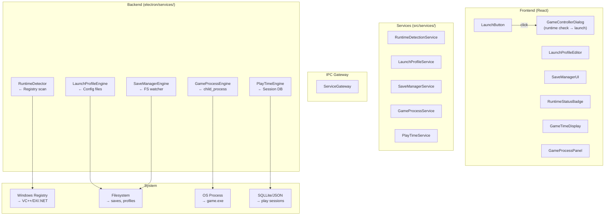

# Game Runtime Environment — Research Pack

> Sistema completo de detección de dependencias, perfiles de lanzamiento, gestión de saves y tracking de tiempo de juego.
> Fecha: Julio 2026

## 1. README.md — Resumen Ejecutivo

### Problema que resuelve
Hoy Y-Core descarga juegos pero no garantiza que funcionen. No verifica dependencias (VC++ Redist, DirectX, .NET), no ofrece perfiles de lanzamiento configurables, no gestiona saves, y no trackea tiempo jugado. El usuario descarga un juego, hace clic en "Jugar", y si algo falla no tiene herramientas para diagnosticar por qué.

### Beneficio
Transforma Y-Core de "download manager" a "launcher profesional" — el usuario puede lanzar, configurar, y mantener sus juegos desde una sola interfaz.

### Sistemas incluidos
| Subsistema | Propósito | Líneas estimadas |
|------------|-----------|:----------------:|
| Runtime Detector | Escanea VC++, DirectX, .NET, OpenAL, XNA | 3,000 |
| Launch Profiles | Args, env vars, compat layers, pre/post scripts | 3,500 |
| Save Manager | Detección automática, backup, restore | 3,000 |
| Game Process Manager | Spawn, monitor, kill, time tracking | 3,500 |
| Compat Layers | Proton, Wine, DXVK, VKD3D | 2,500 |
| UI Components | Editores, badges, paneles | 4,500 |
| **Total** | | **~22,000** |

---

## 2. Architecture.md



---

## 3. Research.md — Proyectos Analizados

### Steam Runtime Detector
- **Qué hace**: Al instalar un juego, Steam verifica que VC++ 2010-2022, DirectX, .NET Framework, XNA, OpenAL, y otros runtimes estén instalados. Si falta alguno, lo instala automáticamente.
- **Cómo lo hace**: Scanea el registro de Windows en `HKLM\SOFTWARE\Microsoft\Windows\CurrentVersion\Uninstall\` buscando GUIDs específicos de cada runtime.
- **Lección**: No confiar en `system('dxdiag')` o comandos externos — los GUIDs del registro son la fuente de verdad más confiable.

### Heroic Games Launcher — Runtime Management
- **Qué hace**: Para juegos de Epic/GOG, Heroic detecta si Wine/Proton está instalado, y permite instalar versiones específicas (Wine-GE, Proton-GE, etc.).
- **Cómo lo hace**: Mantiene un `componentsStore` que cachea la lista de versiones disponibles desde el API de GloriousEggroll. El usuario selecciona una versión, Heroic la descarga y extrae como un componente independiente.
- **Lección**: Las versiones de compat layers deben ser seleccionables por juego, no globales. Heroic permite por-juego y global.

### Bottles — Dependency Manager
- **Qué hace**: Bottles instala dependencias de Windows en prefixes de Wine (VC++ Redist, DirectX, .NET Framework, fuentes). Cada dependencia tiene un manifest YAML con URL, checksum, e instrucciones de instalación.
- **Cómo lo hace**: Los manifests están en `bottles/backend/dependency/` y describen: `url`, `checksum`, `file_name`, `installer_type` (msi, exe, ranu, inno), `installer_flags`, `components` (para instaladores con múltiples componentes seleccionables).
- **Lección**: Tener manifests de dependencias (YAML/JSON) permite agregar nuevas dependencias sin modificar código. Cada dependencia describe cómo se instala, no solo qué archivo descargar.

### Lutris — Runners + Launch Profiles
- **Qué hace**: Lutris organiza los juegos por "runner" (Wine, Steam, Proton, DOSBox, RetroArch, etc.). Cada runner tiene su propia configuración y opciones de lanzamiento.
- **Cómo lo hace**: Los runners son plugins cargados dinámicamente desde `lutris/runners/`. Cada runner define: `get_executable()`, `get_basic_params()`, `get_game_params()`, `get_platform()`, `play()`.
- **Lección**: El diseño de runners como plugins permite agregar soporte para nuevas plataformas (Xbox Game Pass, Amazon Luna, etc.) sin modificar el core. Cada runner es autónomo.

### Playnite — Save Management
- **Qué hace**: Playnite detecta y gestiona saves automáticamente. Cuando lanzas un juego, Playnite puede hacer backup de los saves existentes. Cuando cierras el juego, puede sincronizar saves con la nube (OneDrive, Google Drive, etc.).
- **Cómo lo hace**: Scripts de detección por juego (archivos en carpetas conocidas: `%USERPROFILE%\Documents\My Games\`, `%APPDATA%\`, `%LOCALAPPDATA%\`). Cada juego puede tener una ruta de save customizada. Soporta sincronización vía scripts de usuario.
- **Lección**: La detección automática de saves por patrón (carpetas conocidas, extensiones .sav, fechas de modificación) es el 80% del valor. El 20% restante (juegos con saves en lugares exóticos) se cubre con configuración manual.

---

## 4. Design.md — Decisiones Arquitectónicas

### ADR-001: Runtime Detection via Windows Registry
**Decisión**: Usar GUIDs conocidos del registro de Windows para detectar VC++ Redist, DirectX, .NET Framework, XNA, OpenAL.

**Alternativas consideradas**:
- Ejecutar `dxdiag` / `wmic` → lento, frágil, parsing complejo
- Verificar existencia de DLLs → solo para DirectX, no cubre VC++ ni .NET

**Riesgo**: Microsoft puede cambiar GUIDs entre versiones. Mitigación: mantener una tabla actualizada de GUIDs consultable online + fallback a detección por DLL/archivo.

### ADR-002: Launch Profiles as JSON Config
**Decisión**: Los perfiles de lanzamiento se almacenan como archivos JSON en `<gameDir>/ycore-profile.json`.

**Alternativas**: SQLite (overkill para ~50 juegos), electron-store (no es por-juego), INI (sin anidamiento).

**Riesgo**: Un crash durante la escritura puede corromper el perfil. Mitigación: escribir a temp file + `rename`.

---

## 5. Implementation.md — Plan de Implementación

### Fase 1: Runtime Detector (3,000 líneas, 1 semana)

```
electron/modules/runtime-detector.ts
├── detectRegistryKey(guid: string): Promise<boolean>
├── detectFileExists(path: string): Promise<boolean>
├── detectVcRedist(): Promise<VcRedistResult>
├── detectDirectX(): Promise<DirectXResult>
├── detectDotNet(): Promise<DotNetResult>
├── detectOpenAL(): Promise<boolean>
├── detectAll(): Promise<RuntimeManifest>
├── installRuntime(type: RuntimeType): Promise<boolean>
└── downloadRuntimeInstaller(type: RuntimeType): Promise<string>
```

### Fase 2: Launch Profiles (3,500 líneas, 1 semana)

```
electron/modules/launch-profiles.ts
├── Interface: LaunchProfile { args, env, compat, resolution, hooks }
├── CRUD: create, read, update, delete, setDefault, list
├── PreLaunchHook: run before game starts
├── PostLaunchHook: run after game exits
└── CompatLayerRunner: Proton, Wine, DXVK wrappers
```

### Fase 3: Save Manager (3,000 líneas, 5 días)

```
electron/modules/save-manager.ts
├── AutoDetect: find save files by pattern + known paths
├── Backup: compress saves to .zip in backup dir
├── Restore: extract backup to original location
├── List: show backup history with timestamps
└── Scheduler: automatic backup on game launch
```

### Fase 4: Game Process Manager (3,500 líneas, 1 semana)

```
electron/modules/game-process.ts
├── spawn(gameId, profile): ProcessHandle
├── monitor(handle): AsyncIterable<ProcessEvent>
├── kill(handle): void
├── listRunning(): ProcessHandle[]
└── getPlayTime(gameId): PlayTimeData
```

### Fase 5: UI Components (4,500 líneas, 5 días)

```
src/components/gre/
├── LaunchProfileEditor.tsx     (800 ln)
├── RuntimeStatusBadge.tsx      (300 ln)
├── RuntimeChecker.tsx          (600 ln)
├── SaveManagerUI.tsx           (700 ln)
├── GameTimeDisplay.tsx         (200 ln)
├── GameProcessPanel.tsx        (500 ln)
├── LaunchButton.tsx            (400 ln)
├── LaunchConfigDialog.tsx      (600 ln)
└── CompatLayerSelector.tsx     (400 ln)
```

---

## 6. Testing.md

| Test | Qué verifica | Archivos |
|------|-------------|----------|
| runtime-detector.test.ts | Detección de VC++, DX, .NET via registry mock | 3 |
| launch-profile.test.ts | CRUD de perfiles, serialización, migraciones | 2 |
| save-manager.test.ts | Backup, restore, detección automática | 3 |
| game-process.test.ts | Spawn, monitor, kill, time tracking | 2 |
| playtime.test.ts | Sesiones, persistencia, cálculo | 1 |
| launch-button.test.tsx | Click → runtime check → launch flow | 1 |

---

## 7. Referencias

| Proyecto | Patrón | URL |
|----------|--------|-----|
| Steam | Runtime detection via registry | — |
| Heroic | Component version store | github.com/Heroic-Games-Launcher/HeroicGamesLauncher |
| Bottles | YAML dependency manifests | github.com/bottlesdevs/Bottles |
| Lutris | Runner plugin system | github.com/lutris/lutris |
| Playnite | Save auto-detection | github.com/JosefNemec/Playnite |
| ProtonDB | API de compatibilidad | protondb.com |
| Winetricks | Scripts de dependencias | github.com/Winetricks/winetricks |
