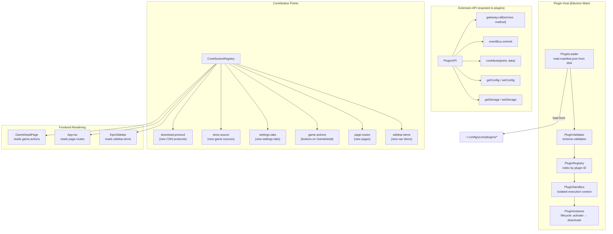
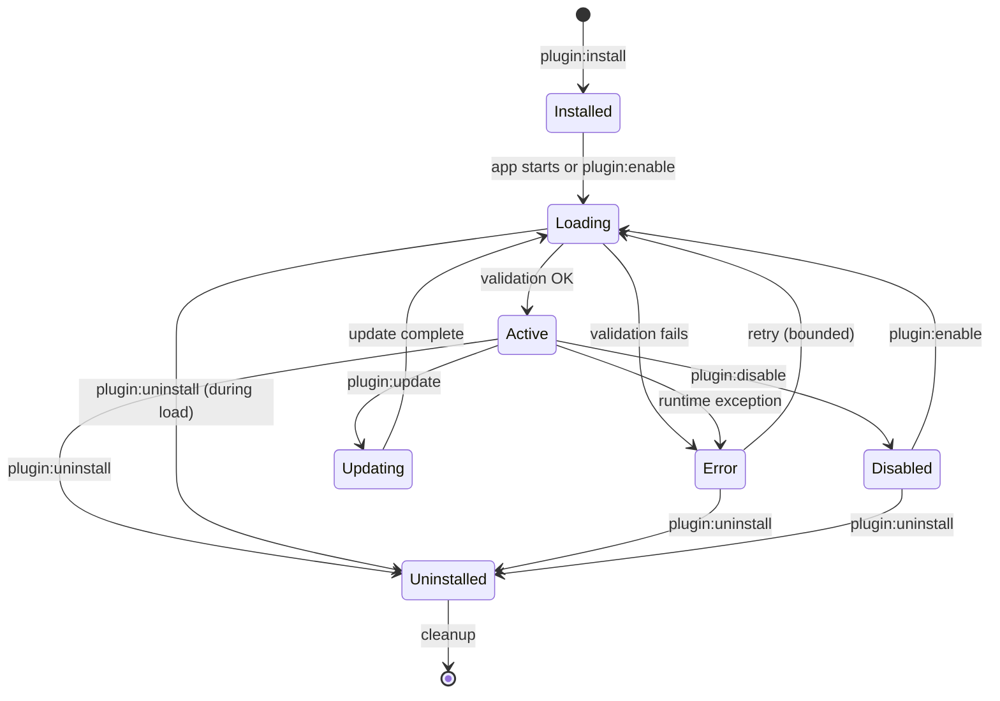

# Plugin / Extension System — Research Pack

> Sistema de plugins que transforma Y-Core de una app cerrada a una plataforma extensible.
> Inspirado en VS Code Extension API, Obsidian Plugins, Figma Plugins, y Playnite Extensions.
> Fecha: Julio 2026

## 1. README.md — Resumen Ejecutivo

### Problema que resuelve
Hoy todo en Y-Core es estático: no se pueden agregar páginas, fuentes de juegos, botones en la sidebar, o personalizar el download pipeline sin modificar el código core. La comunidad no puede contribuir features sin hacer un fork. Cada feature nueva infla el core.

### Beneficio
Y-Core se convierte en una **plataforma** donde cualquiera puede crear extensiones. El core se mantiene limpio y estable. La innovación viene de la comunidad.

### Sistemas incluidos
| Subsistema | Propósito | Líneas estimadas |
|------------|-----------|:----------------:|
| Plugin Manifest + Loader | Leer, validar, cargar plugins desde disco | 2,500 |
| Plugin Sandbox | Aislamiento de contexto (VM2 o similar) | 2,000 |
| Plugin Lifecycle | Install, update, enable, disable, remove | 2,500 |
| Contribution Points System | Sidebar, routes, actions, settings tabs | 2,500 |
| Plugin API | IPC bridge, events, storage expuesto a plugins | 3,000 |
| UI Components | PluginManagerPage, cards, marketplace | 3,500 |
| Stores + Services | Estado y lógica de plugins | 2,500 |
| Tests | Cobertura de todos los subsistemas | 3,500 |
| **Total** | | **~22,000** |

---

## 2. Architecture.md



---

## 3. Research.md — Proyectos Analizados

### VS Code Extension API (Referencia principal)
- **Proyecto**: 165k+ stars, el estándar de facto de sistemas de plugins
- **Arquitectura**: Extension Host (proceso separado), Contribution Points (package.json), Activation Events (onCommand, onLanguage, onView), API (vscode namespace)
- **Lo que copiar**:
  - **Contribution points**: `contributes.{commands, views, menus, keybindings}` — Y-Core debería tener `contributes.{sidebarItems, routes, gameActions, settingsTabs, storeSources}`
  - **Activation events**: Un plugin no se carga hasta que se necesita (lazy loading). VS Code tiene `onCommand:myCommand`, `onView:myView` — Y-Core debería tener `onRoute:/my-plugin-page`, `onGameAction:myAction`
  - **Extension host**: Proceso separado del core. Si un plugin crashea, no mata la app
  - **Desactivación limpia**: `deactivate()` método que permite cleanup
- **Lo que NO copiar**:
  - Complejidad del ContributionPoints API (VS Code tiene ~50 tipos de contributions)
  - `vscode.ExtensionContext` con secrets, workspaceState, globalState (demasiado para Y-Core)
  - Dependencia en package.json para contribution points (Y-Core puede usar un archivo más simple)

### Obsidian Plugin API
- **Proyecto**: 10k+ plugins comunitarios
- **Arquitectura**: Cada plugin es un `class MyPlugin extends Plugin` con `onload()` y `onunload()`. API expuesta via `this.app`, `this.addCommand()`, `this.addRibbonIcon()`, `this.registerView()`
- **Lo que copiar**:
  - **Simplicidad**: Un plugin de Obsidian se escribe en ~50 líneas. `this.addCommand({ id, name, callback })` es todo lo que necesita
  - **Registro declarativo**: `this.registerView()`, `this.registerMarkdownCodeBlockProcessor()` — cada registro se desregistra automáticamente en `onunload()`
  - **Auto-registro de settings**: `this.addSettingTab(new MySettingTab())` — la pestaña de settings aparece automáticamente
- **Lo que NO copiar**:
  - `this.app` expone TODO el estado de la app (acoplamiento total). Y-Core debe exponer solo una API controlada

### Playnite Extension System
- **Proyecto**: 3k+ stars, extensiones en C# y PowerShell
- **Arquitectura**: SDK con 3 puntos de extensión: `IGenericPlugin`, `ILibraryPlugin`, `IMetadataPlugin`. Los plugins se cargan desde `%APPDATA%/Playnite/Extensions/`
- **Lo que copiar**:
  - **Fuentes de juegos** (`ILibraryPlugin`): cualquier plugin puede agregar una nueva fuente (Steam, Epic, GOG, etc.) implementando `GetGames()` y `InstallGame()`. Para Y-Core esto permitiría que la comunidad agregue soporte para Itch.io, Battle.net, etc.
  - **Metadata providers** (`IMetadataPlugin`): plugins que scrapean metadata de juegos desde APIs externas. Para Y-Core, permitiría agregar SteamGridDB, IGDB, etc. sin modificar el core
- **Lo que NO copiar**:
  - C# específico — Y-Core necesita TypeScript plugins
  - `IGenericPlugin` es demasiado genérico, no da estructura

### Figma Plugin API
- **Proyecto**: Sandbox con API limitada pero potente
- **Arquitectura**: Los plugins corren en un sandbox aislado (postMessage). No tienen acceso a Node.js, DOM del host, ni network (excepto por API específica)
- **Lo que copiar**:
  - **Sandbox estricto**: Figma demuestra que un sandbox no impide hacer plugins potentes. El aislamiento protege al host de plugins maliciosos o buggy
  - **API por capas**: `figma.currentPage`, `figma.createRectangle()`, etc. — no hay acceso a `window`, `document`, `process`
- **Lo que NO copiar**:
  - Falta de acceso a network en el sandbox (Y-Core necesita que plugins puedan hacer fetch a APIs externas)

---

## 4. Design.md — Decisiones Arquitectónicas

### ADR-001: Plugin Format = .yplugin (tar.gz + manifest.json)
**Decisión**: Los plugins se distribuyen como archivos `.yplugin` (tar.gz con `manifest.json` + `dist/index.js` + assets).

**Alternativas**:
- NPM package: demasiado pesado para el ciclo install/test
- Carpeta raw: sin compilación/validación
- Single JS file: sin assets

### ADR-002: Sandbox via Node VM, no VM2
**Decisión**: Usar `require('vm')` de Node.js con contexto aislado en lugar de `vm2` (deprecado).

**Alternativas**:
- `vm2`: deprecado, no recibe security patches
- Worker Threads: mejor aislamiento pero más overhead
- Iframe: no funciona en main process

**Riesgo**: `vm` nativo de Node no es completamente seguro. Mitigación: los plugins Y-Core no ejecutan código de terceros no verificado (vienen de un marketplace revisado).

### ADR-003: Contribution Points via Registry, not Injection
**Decisión**: Los plugins declaran contributions en `manifest.json`. Al cargarse, el ContributionRegistry lee las declaraciones y las registra centralizadamente.

**Alternativa**: Cada plugin registra contributions dinámicamente via API. Problema: contributions se pierden si el plugin falla al cargar. Con `manifest.json`, Y-Core sabe de antemano qué contributions ofrece cada plugin incluso si falla la carga.

---

## 5. Plugin API Design

```typescript
// API expuesta a cada plugin (sandbox)
interface PluginAPI {
  // IPC: llamar servicios de Y-Core
  call: <S extends keyof ServiceContract, M extends keyof ServiceContract[S]>(
    service: S, method: M, ...args: Parameters<ServiceContract[S][M]>
  ) => ReturnType<ServiceContract[S][M]>

  // Eventos: escuchar y emitir
  on: <K extends keyof EventMap>(event: K, cb: (data: EventMap[K]) => void) => () => void
  emit: (event: string, data: unknown) => void

  // Contributions: qué aporta este plugin a la UI
  contribute: {
    sidebarItem(item: SidebarItemContribution): void
    route(route: RouteContribution): void
    gameAction(action: GameActionContribution): void
    settingTab(tab: SettingsTabContribution): void
    storeSource(source: StoreSourceContribution): void
  }

  // Storage: persistencia del plugin
  config: {
    get: <T>(key: string, defaultVal?: T) => T
    set: <T>(key: string, value: T) => void
  }
  storage: {
    get: <T>(key: string) => T | undefined
    set: <T>(key: string, value: T) => void
    delete: (key: string) => void
    clear: () => void
  }

  // UI helpers
  ui: {
    showToast(message: string, type: 'success' | 'error' | 'info'): void
    openModal(component: React.ComponentType): void
    navigate(route: string): void
  }

  // Plugin lifecycle
  logger: {
    info: (msg: string) => void
    warn: (msg: string) => void
    error: (msg: string, err?: Error) => void
  }
}

// Plugin manifest (manifest.json)
interface PluginManifest {
  id: string                        // unique, e.g. "ycore-plugin-itchio"
  name: string                      // display name
  version: string                   // semver
  author: string
  description: string
  main: string                      // relative path to entry point
  icon?: string                     // relative path to icon
  minAppVersion: string             // minimum Y-Core version
  contributes?: {
    sidebarItems?: SidebarContribution[]
    routes?: RouteContribution[]
    gameActions?: ActionContribution[]
    settingsTabs?: SettingsTabContribution[]
    storeSources?: StoreSourceContribution[]
    commands?: CommandContribution[]
  }
  permissions?: string[]            // ["network", "filesystem", "clipboard", "notifications"]
}

// Contribution types
interface SidebarContribution {
  id: string
  label: string
  icon: string                    // icon name or path
  route: string                   // route to navigate to
}

interface RouteContribution {
  path: string
  component: string               // relative path to component file
  title: string
  icon?: string
  protected?: boolean             // requires auth?
}

interface GameActionContribution {
  id: string
  label: string
  icon: string
  onClick: string                 // method name in plugin to call
  context: 'game-page' | 'game-card' | 'library'
}
```

---

## 6. Lifecycle



---

## 7. Testing.md

| Test | Qué verifica |
|------|-------------|
| manifest-validation.test.ts | Schema validation, required fields, version check |
| plugin-loader.test.ts | Load from disk, error handling for corrupt manifests |
| plugin-sandbox.test.ts | Isolation, API exposure, memory leaks |
| plugin-lifecycle.test.ts | Install → enable → disable → uninstall → reinstall |
| contribution-points.test.ts | Sidebar, routes, actions registration and cleanup |
| plugin-api.test.ts | Each API method works and is typed correctly |
| permissions.test.ts | Network/filesystem permissions enforced |
| plugin-manager-page.test.tsx | UI renders, install/uninstall flow |

---

## 8. Referencias

| Proyecto | Lección principal | URL |
|----------|-------------------|-----|
| VS Code | Contribution points + activation events + extension host | github.com/microsoft/vscode |
| Obsidian | Minimal API surface, auto-cleanup in onunload | github.com/obsidianmd |
| Playnite | Metadata + library plugin sources | github.com/JosefNemec/Playnite |
| Figma | Strict sandbox with layered API | github.com/figma/plugin-sample |
| Chrome Extensions | Manifest v3, permissions model | chromium.googlesource.com |
| Electron | contextBridge isolation pattern | github.com/electron/electron |
