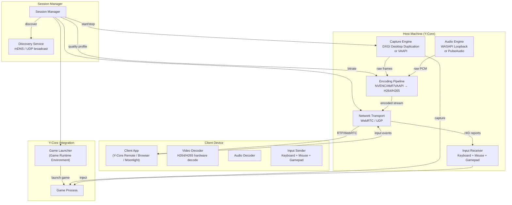
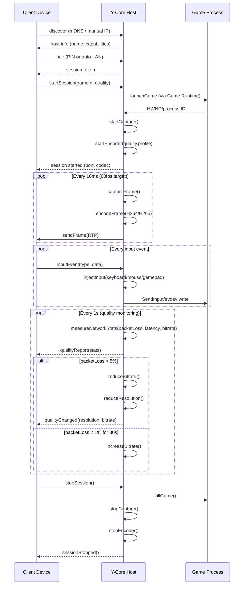

# Remote Play System — Research Pack

> Sistema de streaming de juegos LAN y remoto para Y-Core.
> Inspirado en Steam Remote Play, Sunshine, Moonlight, Chiaki, y RustDesk.
> Fecha: Julio 2026

## 1. README.md — Resumen Ejecutivo

### Problema que resuelve
Y-Core descarga y lanza juegos en una sola máquina. No hay forma de jugar en otra computadora de la casa, o de transmitir juegos a dispositivos móviles. Los usuarios necesitan una solución integrada de streaming.

### Beneficio
Un sistema de Remote Play convierte a Y-Core en una **plataforma de gaming en red**. El usuario puede jugar sus juegos de Y-Core desde cualquier dispositivo en su red LAN, o remotamente desde internet.

### Sistemas incluidos
| Subsistema | Propósito | Líneas estimadas |
|------------|-----------|:----------------:|
| Capture Engine | Captura de video (DXGI/VAAPI) + audio (WASAPI/PulseAudio) | 4,000 |
| Encoding Pipeline | Codificación H264/H265/AV1 con hardware acceleration | 3,500 |
| Network Transport | Streaming via TCP/UDP/WebRTC con adaptive bitrate | 3,500 |
| Input Forwarding | Teclado, ratón, mando HID forward | 2,500 |
| Discovery + Pairing | Auto-descubrimiento LAN + pairing remoto | 2,000 |
| Session Management | Start, stop, quality, active sessions | 2,500 |
| UI Components | Device panel, quality controls, status | 3,000 |
| **Total** | | **~21,000** |

---

## 2. Architecture.md



---

## 3. Research.md — Proyectos Analizados

### Steam Remote Play (Referencia principal)
- **Qué hace**: Stream de juegos Steam desde PC host a clientes (PC, Mac, Android, iOS, TV, Steam Deck). Soporta LAN y remoto, gamepad, rumble, y hasta 4 jugadores locales remotos.
- **Arquitectura**: Software encoding (x264/x265) + opcional NVENC. Transporte UDP con FEC (Forward Error Correction). Adaptive bitrate basado en latencia de red. Input forwarding via Steam Controller API con polling a 60Hz.
- **Lo que copiar**:
  - **Adaptive bitrate**: Ajustar calidad automáticamente según las condiciones de red. Si hay packet loss, baja resolución/bitrate. Si mejora, sube.
  - **Game stream session**: Iniciar sesión → lanzar juego → mostrar overlay → gestionar inputs → detener sesión → cleanup. Ciclo de vida claro.
  - **LAN priority**: Detectar clientes en la misma red y hacer streaming directo sin relay.
- **Lo que NO copiar**:
  - Dependencia en Steam Controller API (Y-Core necesita soporte de gamepad genérico)
  - Reliance en Steam Relay Network para conexiones remotas (Y-Core necesita su propio mecanismo)

### Sunshine + Moonlight
- **Sunshine**: Host open-source para streaming de juegos (fork de Moonlight Embedded). Soporta NVENC, AMF, VAAPI, Software encoding. Compatible con clientes Moonlight.
- **Moonlight**: Cliente open-source para streaming desde hosts NVIDIA GameStream o Sunshine.
- **Arquitectura**:
  - Sunshine captura video via DXGI (Windows) o KMS (Linux)
  - Codifica con NVENC/AMF/VAAPI o software (x264/x265)
  - Stream via RTP sobre UDP con FEC
  - Input forwarding via evdev (Linux) o SendInput (Windows)
  - Descubrimiento via mDNS (Avahi/Bonjour)
- **Lo que copiar**:
  - **DXGI Desktop Duplication**: API de Windows para capturar frames con mínimo overhead. Sunshine la usa con gran eficiencia.
  - **NVENC/AMF abstraction**: Sunshine tiene una capa de abstracción de encoders que permite intercambiar NVENC ↔ AMF ↔ VAAPI ↔ software sin cambiar el resto del pipeline.
  - **mDNS discovery**: Auto-descubrimiento de hosts en LAN. El usuario no necesita configurar IPs manualmente.
  - **FEC over UDP**: Forward Error Correction reduce la necesidad de retransmisiones para video streaming.
- **Lo que NO copiar**:
  - Dependencia en libavahi/libbonjour (Y-Core puede usar dns-sd nativo de Node.js)
  - Sunshine usa C++20 — Y-Core necesita TypeScript con native addon para capture

### Chiaki (PS4/PS5 Remote Play)
- **Qué hace**: Cliente open-source de Remote Play para PlayStation 4 y 5
- **Arquitectura**: Decodificación H264 via FFmpeg, transporte UDP con protocolo propietario de Sony, input forwarding con DualShock/DualSense
- **Lo que copiar**:
  - **FFmpeg integration**: Chiaki demuestra que FFmpeg es la mejor opción para decodificación cross-platform
  - **Controller rumble forwarding**: Forward de rumble del gamepad remoto al local (Steam Remote Play también lo hace)
- **Lo que NO copiar**:
  - Protocolo propietario de Sony (reverse-engineered, frágil)

### RustDesk
- **Qué hace**: Remote Desktop open-source (alternativa a TeamViewer/AnyDesk)
- **Arquitectura**: Relay server opcional para conexiones NAT traversal. Protocolo propietario sobre TCP. Encoding software (x264). 100k+ líneas de Rust.
- **Lo que copiar**:
  - **Relay server**: Para conexiones remotas (no LAN), RustDesk tiene un relay server que maneja NAT traversal. Y-Core necesita un relay similar o usar STUN/TURN.
  - **NAT traversal**: UDP hole punching + relay fallback. Funciona para la mayoría de configuraciones de red.
- **Lo que NO copiar**:
  - RustDesk es 100k+ líneas de Rust para remote desktop completo — Y-Core solo necesita game streaming, no remote desktop

### WebRTC
- **Qué hace**: Estándar para comunicación en tiempo real peer-to-peer (video, audio, data channels)
- **Arquitectura**: ICE (Interactive Connectivity Establishment) para NAT traversal, SRTP/SCTP para transporte, codecs negociados (VP8, VP9, H264, AV1)
- **Lo que copiar**:
  - **ICE framework**: STUN + TURN + UDP hole punching. WebRTC tiene el mejor NAT traversal del mercado.
  - **Adaptive bitrate via Google Congestion Control**: Algoritmo probado en millones de llamadas
- **Lo que NO copiar**:
  - WebRTC completo es pesado (~20MB de librerías nativas). Usar solo el módulo de ICE si es posible

---

## 4. Design.md — Decisiones Arquitectónicas

### ADR-001: Capture via Native Addon
**Decisión**: El capture engine se implementa como un native addon de Node.js (node-gyp/N-API) que llama a:
- Windows: DXGI Desktop Duplication API
- Linux: KMS/DRM + PipeWire
- macOS: CGDisplayStream / AVFoundation

**Alternativas**: Capturar ventana via screenshot + compare (10fps máximo), o via FFmpeg gdigrab (CPU intensivo).
**Líneas**: ~2,000 C++ + 500 TypeScript bindings.

### ADR-002: Transport via WebRTC
**Decisión**: Usar WebRTC para el transporte de streaming (video, audio, input).
**Alternativas**: UDP raw + custom protocol (como Moonlight), TCP + HTTP Streaming (latencia alta).
**Justificación**: WebRTC ofrece NAT traversal, adaptive bitrate, FEC, y codec negotiation out of the box. La flexibilidad es menor que UDP raw pero el time-to-market es mucho menor.

### ADR-003: Client = Web App (no Electron)
**Decisión**: El cliente de Remote Play es una web app (React + WebRTC + WebCodecs), NO una app Electron. Puede correr en el browser de cualquier dispositivo.
**Alternativas**: Electron app (600MB+), app nativa iOS/Android (mantenimiento separado).
**Justificación**: Con WebCodecs API moderna (Chrome 94+, Edge 94+, Safari 16.4+), los browsers pueden decodificar H264/H265 por hardware. No requiere instalar nada.

---

## 5. Pipeline de Streaming



---

## 6. UI Components

```
src/components/remote-play/
├── DeviceDiscovery.tsx           ← Find hosts on LAN + manual IP entry
├── DeviceCard.tsx                ← Host info, name, status, connect button
├── PairingDialog.tsx             ← PIN entry / auto-pair
├── QualitySettings.tsx           ← Resolution, bitrate, FPS selector
├── StreamViewer.tsx              ← <video> element with WebRTC
├── ConnectionStatus.tsx          ← Latency, bitrate, packet loss overlay
├── InputSettings.tsx             ← Gamepad, keyboard, mouse config
├── SessionManagerDialog.tsx      ← Active sessions, stop, quality adjust
└── RemotePlayPage.tsx            ← Main page for Remote Play
```

**Stores nuevos**:
```typescript
src/stores/
├── useRemotePlayStore.ts         ← Hosts, sessions, connection state
├── useRemotePlayQualityStore.ts  ← Quality profiles, saved settings
```

**Services nuevos**:
```typescript
src/services/
├── RemotePlayDiscoveryService.ts ← mDNS / manual host discovery
├── RemotePlaySessionService.ts   ← Start, stop, monitor sessions
├── RemotePlayPairingService.ts   ← PIN pairing + token management

electron/services/
├── RemotePlayDiscoveryService.ts ← Broadcast + respond to mDNS
├── RemotePlayStreamService.ts    ← Capture + encode + send pipeline
├── RemotePlayInputService.ts     ← Receive + inject input events
├── RemotePlayPairingService.ts   ← PIN generation + verification
```

---

## 7. Testing.md

| Test | Qué verifica |
|------|-------------|
| capture-engine.test.ts | Frame capture rate, resolution, format |
| encoding-pipeline.test.ts | Encoder selection, quality profiles |
| network-transport.test.ts | Latency, packet loss recovery, bitrate adaptation |
| input-forwarding.test.ts | Keyboard, mouse, gamepad injection |
| discovery.test.ts | mDNS discovery, manual IP, timeout |
| pairing.test.ts | PIN flow, token verification, timeout |
| session-lifecycle.test.ts | Start → play → stop, cleanup |
| adaptive-bitrate.test.ts | Quality changes based on network conditions |

---

## 8. Referencias

| Proyecto | Lección principal | URL |
|----------|-------------------|-----|
| Steam Remote Play | Adaptive bitrate, session lifecycle, LAN priority | — |
| Sunshine | DXGI capture, NVENC/AMF abstraction, mDNS | github.com/LizardByte/Sunshine |
| Moonlight | Client-side decode, gamepad forwarding | github.com/moonlight-stream/moonlight-qt |
| Chiaki | FFmpeg integration, controller rumble | github.com/streetpea/chiaki-ng |
| RustDesk | NAT traversal, relay server design | github.com/rustdesk/rustdesk |
| WebRTC | ICE framework, congestion control | webrtc.googlesource.com |
| OBS Studio | Source→filter→encoder pipeline | github.com/obsproject/obs-studio |
| FFmpeg | Cross-platform encode/decode | github.com/FFmpeg/FFmpeg |
