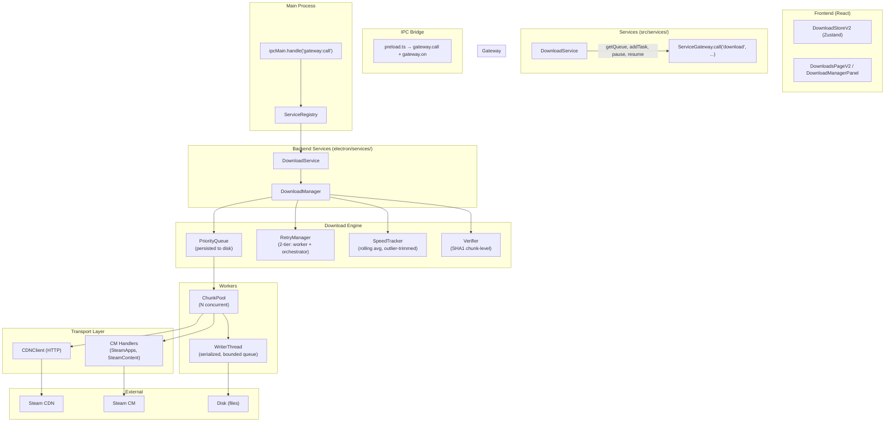

# Download Engine — Síntesis Comparativa

> Comparación transversal de 10 proyectos Open Source analizados como referencia para el motor de descargas de Y-Core.
> Fecha: Julio 2026

## Resumen

Esta síntesis compara 10 proyectos que implementan descarga de archivos/grandes volúmenes en diferentes contextos: game launchers (Heroic, Legendary, Lutris, Playnite, Bottles), download managers (aria2, qBittorrent, Transmission), y plataformas de protocolo/referencia (SteamKit2, VS Code). De todos ellos, **SteamKit2 y Legendary son las referencias más relevantes** por su dominio directo (Steam protocol / game download engine) y su sofisticación arquitectónica. **Heroic Games Launcher** es la referencia más cercana en stack tecnológico (TypeScript + Electron + React).

## Matriz Comparativa

| Dimensión | Heroic | Legendary | Lutris | Playnite | Bottles | SteamKit2 | aria2 | qBittorrent | Transmission | VS Code |
|-----------|:------:|:---------:|:------:|:--------:|:-------:|:---------:|:----:|:-----------:|:------------:|:-------:|
| **Arquitectura** | 7/10 | 9/10 | 8/10 | 6/10 | 5/10 | 10/10 | 9/10 | 8/10 | 7/10 | 9/10 |
| **Queue design** | FIFO single-flight | Ordered deque + shared mem | Named-op gating | None (delegated) | FIFO sequential | No queue (lib) | BTree priority | Custom priority | FIFO/Sort | No queue |
| **Concurrencia** | 1 game at a time | N workers + 1 writer | 4 threads + writer | Delegated to CLI | Sequential | Async only | N workers + bitfield | N torrents + libtorrent | N torrents + libtorrent | 4-8 build jobs |
| **Resumabilidad** | None (CLI-owned) | Chunk-set file-level | Byte-range (GOG only) | None (delegated) | None | Chunk-level SHA1 | Byte-range + metainfo | Bitfield + piece-level | Bitfield + piece-level | None |
| **Verificación** | SHA-512 (wine only) | AES-GCM + manual SHA1 | SHA-256 opt-in | None (delegated) | SHA-256 mandatory | SHA1 chunk-level | SHA1/info-hash | SHA1 piece-level | SHA1 piece-level | SHA-256 |
| **Retry** | None (game), linear (ping) | Exponential (7x) + re-queue | Linear (3x) + stall | None | 1 retry on checksum | Fixed (3x) | Exponential | libtorrent built-in | libtorrent built-in | None |
| **IPC / Capas** | Shared IPC types | Multiprocessing.Queue | Thread/GLib barrier | Plugin SDK | GTK signals | Handler pattern + CDN | gRPC/XML-RPC | WebUI API | RPC + web | Extension host |
| **Memory mgmt** | None | Shared memory pool | Bounded queue (64) | None | None | None | Bitfield + SHA1 | libtorrent mgd | libtorrent mgd | Workspace model |
| **Testing** | Utility-only | None | Extensive (2k+ lines) | Plugin tests | Limited | Integration-only | Extensive | Extensive | Extensive | Extensive |
| **Documentación** | Good (CHANGELOG, docs/) | Minimal (README) | Excellent (6 doc dirs) | Good (SDK docs) | Good (CODING_GUIDE) | Excellent (15+ yr) | Excellent (man pages) | Good (WebAPI doc) | Good (man pages) | Excellent |
| **Stack** | TS/Electron | Python | Python/GTK | C#/WPF | Python/GTK | C#/.NET | C++ | C++/Qt | C | TS/Electron |

## Patrones Ganadores

### 1. Transport Boundary Separation (SteamKit2)
**Qué es**: El código de descarga debe separarse por tipo de transporte, no por feature. Autorización (CM protocol, mensajes pequeños, binarios) y bulk transfer (CDN HTTP, grandes payloads) deben estar en clases/archivos diferentes.

**Proyectos que lo usan**: SteamKit2, Legendary (manager process ≠ CDN HTTP workers)

**Por qué funciona**: Los dos tipos de transporte tienen modos de fallo diferentes (timeout de red vs error de protocolo vs corrupción de datos), requisitos de concurrencia diferentes (serial vs paralelo), y ciclos de vida diferentes. Mezclarlos en una sola clase crea acoplamiento que dificulta testear y mantener.

**Aplicación en Y-Core**: Separar `depot-downloader.ts` en:
- `SteamAppsHandler` (CM: depot keys, licenses)
- `SteamContentHandler` (CM: manifest codes, auth tokens)
- `CDNClient` (HTTP: manifests, chunks)
- `DepotDownloadService` (orquestación que compone los tres)

### 2. Handler Pattern + Broadcast Dispatch (SteamKit2)
**Qué es**: Cada paquete entrante se envía a TODOS los handlers registrados; cada handler ignora lo que no le pertenece via un `switch`/`if`. No hay tabla de ruteo central.

**Proyectos que lo usan**: SteamKit2, VS Code (extension host contributions)

**Por qué funciona**: Agregar un handler NUNCA requiere modificar el dispatcher central. Es el patrón de extensibilidad más simple que existe: subclass + register + done. El costo (N checks por mensaje) es despreciable.

**Aplicación en Y-Core**: El Service Gateway debería usar este patrón para el canal de eventos IPC. Cada handler/service se registra con `gateway.registerHandler('serviceName', handler)` y los mensajes entrantes se distribuyen por nombre de servicio.

### 3. Precomputed Memory Budget (Legendary)
**Qué es**: Antes de empezar una descarga, Legendary analiza el manifest y calcula EXACTAMENTE cuánta memoria compartida se necesita. Si no cabe, falla rápido con un mensaje accionable (`--max-shared-memory <N>`).

**Proyectos que lo usan**: Legendary

**Por qué funciona**: Las descargas de juegos pueden durar horas. Un OOM a los 45 minutos es una experiencia de usuario catastrófica. Fallar rápido con una sugerencia concreta es mucho mejor.

**Aplicación en Y-Core**: Antes de iniciar una descarga de depot, calcular el tamaño máximo de chunk in-flight (workers × chunk_size) y verificar que hay suficiente memoria. Si no, reducir workers o fallar con sugerencia.

### 4. Two-Tier Retry (Legendary)
**Qué es**: Cada worker tiene su propio loop de retry con backoff exponencial (capped). Si se agotan los reintentos, el orquestador re-encola la tarea fallida para otro intento.

**Proyectos que lo usan**: Legendary (workers: 7 retries exponencial + manager: re-queue unbounded)

**Por qué funciona**: Un error transitorio de red se resuelve rápido a nivel worker sin involucrar al orquestador. Un error persistente (servidor caído) escala al orquestador que puede esperar más, cambiar de servidor, o notificar al usuario.

**Aplicación en Y-Core**: Two-tier retry en el download engine:
- ChunkDownloader: 5 retries con backoff 2^t segundos (1s, 2s, 4s, 8s, 16s)
- DownloadManager: re-encola chunks fallidos con backoff más lento (30s, 60s, 120s...)

### 5. Writer Thread + Bounded Queue (Lutris, Legendary)
**Qué es**: Un solo thread/proceso dedicado a escritura en disco, con una cola acotada que los workers de red alimentan. Cuando la cola se llena, los workers de red bloquean (backpressure natural).

**Proyectos que lo usan**: Lutris (`maxsize=64`), Legendary (`FileWorker` process)

**Por qué funciona**: La escritura en disco es inherentemente serial (no se beneficia de concurrencia). Aislarla en un thread dedicado evita contentión, corrupción, y bounds el uso de memoria.

**Aplicación en Y-Core**: Un `DiskWriter` thread/worker queue que recibe chunks completados y los escribe secuencialmente. Workers de red paran de descargar si la cola de escritura está llena.

### 6. Chunk-Level Resume with SHA1 Verification (SteamKit2 DepotDownloader)
**Qué es**: Cada chunk descargado se verifica contra su SHA1 del manifest antes de escribir. Los chunks verificados se marcan como completados. En restart, solo se descargan los chunks faltantes o corruptos.

**Proyectos que lo usan**: SteamKit2 (DepotDownloader sample), Legendary (chunk-set resume file)

**Por qué funciona**: Ofrece resumabilidad a nivel de chunk (~1MB) sin la complejidad de resumabilidad a nivel de byte. La verificación SHA1 es obligatoria, no opcional.

## Anti-Patrones Detectados

### 1. Sin capa de servicios (Heroic, Y-Core hoy)
**Proyectos que lo sufren**: Heroic (stores → window.api.* directo), Y-Core (stores → window.steamtools.* directo)

**Por qué es malo**: Testear un store requiere mockear 88+ métodos del bridge. La lógica de negocio se replica entre stores y hooks. Agregar una feature requiere tocar 4+ archivos.

### 2. Regex-scraping de stdout para progreso (Heroic)
**Proyectos que lo sufren**: Heroic (`onInstallOrUpdateOutput()`)

**Por qué es malo**: Un cambio en el formato de logs del CLI subyacente rompe la barra de progreso silenciosamente. No hay verificación en compile-time, solo runtime.

**Alternativa**: Usar un canal estructurado de progreso (eventos IPC tipados, callbacks con dataclass).

### 3. Sin verificación post-descarga (Heroic, Playnite)
**Proyectos que lo sufren**: Heroic (game installs), Playnite (delegated)

**Por qué es malo**: Un archivo corrupto se instala sin advertencia. El usuario descubre el problema cuando el juego no arranca.

**Alternativa**: Verificación SHA1 obligatoria de cada chunk contra el manifest (SteamKit2 pattern).

### 4. Sin resumabilidad (Bottles, Playnite)
**Proyectos que lo sufren**: Bottles (deletes partial files), Playnite (delegated)

**Por qué es malo**: Perder 40 GB de descarga por un crash o hibernación es una experiencia de usuario inaceptable.

**Alternativa**: Chunk-level resume con tracking de chunks completados (SteamKit2, Legendary patterns).

### 5. Single-flight queue sin prioridad (Heroic, Bottles)
**Proyectos que lo sufren**: Heroic (FIFO only, no reordering), Bottles (sequential)

**Por qué es malo**: El usuario no puede priorizar una descarga sobre otra sin cancelar y re-agregar.

**Alternativa**: Priority queue con reordering API (como qBittorrent/aria2).

## Arquitectura Propuesta para Y-Core

### Justificación

Esta arquitectura combina los mejores patrones identificados:

1. **SteamKit2 handler pattern** para la comunicación con Steam CM (broadcast dispatch, handler registry)
2. **Legendary's memory budget + two-tier retry** para operaciones de descarga robustas
3. **Lutris writer thread + bounded queue** para backpressure natural
4. **SteamKit2 chunk-level SHA1 verification** como verificación obligatoria
5. **Heroic's shared IPC types** para type safety entre frontend y backend
6. **Service Layer + Gateway** (de architecture-proposals.md) como capa de abstracción

### Trade-offs aceptados

- **Mayor complejidad inicial** vs solución simple (Heroic-style): ~5,000 líneas adicionales para el engine vs ~1,000 para un wrapper de CLI
- **Overhead de memoria para el chunk pool**: compensado por el precomputed budget (falla rápido si no cabe, no OOM)
- **Latencia adicional del writer thread**: despreciable comparado con la latencia de red, y evita corrupción por escritura concurrente

### Proyectos de referencia que más influyeron

| Patrón | Fuente principal | Fuente secundaria |
|--------|----------------|-------------------|
| Handler dispatch | SteamKit2 | VS Code |
| Memory budget | Legendary | — |
| Two-tier retry | Legendary | aria2 |
| Writer thread + bounded queue | Lutris | Legendary |
| SHA1 verification | SteamKit2 | Transmission |
| Shared IPC types | Heroic | — |
| Priority queue | aria2 | qBittorrent |
