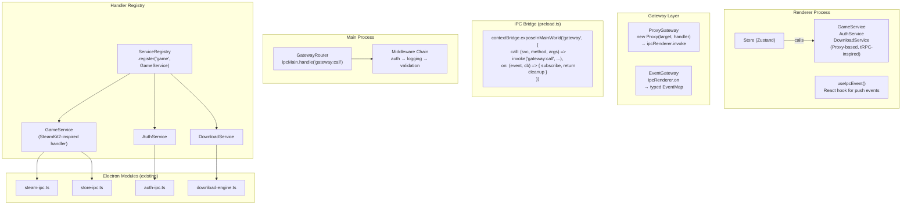

# Service Layer + IPC Gateway — Síntesis Comparativa

> Comparación de 4 patrones de IPC analizados como referencia para la capa de servicios + gateway de Y-Core.
> Fecha: Julio 2026

## Resumen

Esta síntesis compara 4 enfoques de comunicación entre procesos/capas: **SteamKit2** (handler pattern en C#), **Heroic Games Launcher** (shared IPC types en Electron), **Comlink** (proxy-based RPC en TypeScript), **tRPC** (type-safe RPC framework), y **Electron** (IPC nativo). El objetivo es diseñar el Service Layer + IPC Gateway de Y-Core combinando los mejores patrones de cada uno.

## Matriz Comparativa

| Dimensión | SteamKit2 Handler | Heroic IPC Types | Comlink | tRPC | Electron Native |
|-----------|:-----------------:|:----------------:|:-------:|:----:|:---------------:|
| **Type safety** | Runtime + compile | Compile-only | Generic-based | Full inference | Manual |
| **Surface area** | N handlers | N channels | 2 functions | 1 router | N channels |
| **Extensibility** | `AddHandler(h)` | New channel def | New exposed obj | New router proc | New invoke/handle |
| **Transport coupling** | Abstracted (CMClient) | Tight | Abstracted (postMessage) | Abstracted (links) | Tight (IPC) |
| **Error handling** | Centralized fan-out | Per-handler | Forwarded | Middleware chain | Per-handler |
| **Boilerplate** | 1 base class | 3 files + type def | None (Proxy) | 1 router def | 3 files per channel |
| **Testing isolation** | High (mock client) | Medium (mock window) | High (mock port) | High (mock router) | Low (mock ipc) |
| **Complexity** | Low | Medium | Very low | Medium | Low (per channel) |

## Patrón Ganador: Hybrid Gateway + Handler Registry

Ninguno de los 5 enfoques es completo por sí solo para Y-Core. El diseño óptimo combina:

```
tRPC Router Composition     → Service routing hierárquico
SteamKit2 Handler Pattern   → Event dispatch + extensibilidad
Comlink Proxy               → Frontend service stubs sin boilerplate
Heroic Shared Types         → Tipo de contrato compartido entre procesos
Electron IPC                → Transporte subyacente (invoke/handle)
```

### Arquitectura Propuesta



## Diseño Detallado del Service Gateway

### 1. Contrato Compartido (Heroic-inspired)

```typescript
// electron/common/service-contract.ts
// Importado por preload.ts, main.ts, y src/services/*

export interface ServiceContract {
  game: {
    listInstalled(): ListGamesResult
    listAll(): ListGamesResult
    getById(appId: string): GameDetail
    launch(appId: string, profileId?: string): LaunchResult
    uninstall(appId: string): UninstallResult
    verify(appId: string): VerifyResult
  }
  auth: {
    isAuthenticated(): boolean
    getUsername(): string
    login(token: string): LoginResult
    logout(): void
  }
  download: {
    createTask(params: DownloadParams): string
    startTask(taskId: string): void
    pauseTask(taskId: string): void
    cancelTask(taskId: string): void
    getQueue(): DownloadTask[]
    getHistory(): DownloadHistoryEntry[]
  }
  config: {
    get(key: string): unknown
    set(key: string, value: unknown): void
    getAll(): Record<string, unknown>
  }
  // ... etc
}
```

### 2. Proxy Gateway (Comlink + tRPC-inspired)

```typescript
// src/services/gateway.ts
// Single file, ~50 lines. Reusable for ALL services.

import type { ServiceContract } from '../../electron/common/service-contract'

type Gateway = {
  call<S extends keyof ServiceContract, M extends keyof ServiceContract[S]>(
    service: S, method: M, ...args: Parameters<ServiceContract[S][M]>
  ): Promise<ReturnType<ServiceContract[S][M]>>
  on<K extends keyof EventMap>(event: K, cb: (data: EventMap[K]) => void): () => void
}

// Exposed by preload.ts as window.gateway
declare global {
  interface Window { gateway: Gateway }
}

// Service factory — creates a typed proxy for any service
export function createService<T extends keyof ServiceContract>(name: T): ServiceContract[T] {
  return new Proxy({} as ServiceContract[T], {
    get(_, method: string) {
      return (...args: unknown[]) => window.gateway.call(name, method as any, ...args)
    }
  })
}

// Pre-created services
export const gameService = createService('game')
export const authService = createService('auth')
export const downloadService = createService('download')
export const configService = createService('config')
```

### 3. Backend Registry (SteamKit2-inspired)

```typescript
// electron/services/registry.ts
// Single file, ~30 lines.

import type { ServiceContract } from '../common/service-contract'

type ServiceHandlers = {
  [S in keyof ServiceContract]: {
    [M in keyof ServiceContract[S]]: (
      ...args: Parameters<ServiceContract[S][M]>
    ) => ReturnType<ServiceContract[S][M]>
  }
}

class ServiceRegistry {
  private handlers = new Map<string, Record<string, Function>>()

  register<S extends keyof ServiceContract>(
    name: S,
    impl: ServiceHandlers[S]
  ): void {
    this.handlers.set(name as string, impl as Record<string, Function>)
  }

  getHandler<S extends keyof ServiceContract, M extends keyof ServiceContract[S]>(
    service: S, method: M
  ): ServiceHandlers[S][M] | null {
    return this.handlers.get(service as string)?.[method as string] as any ?? null
  }

  getService<S extends keyof ServiceContract>(name: S): ServiceHandlers[S] {
    return this.handlers.get(name as string) as any
  }
}

export const registry = new ServiceRegistry()
```

### 4. Middleware Chain (tRPC-inspired)

```typescript
// electron/services/middleware.ts
// ~40 lines.

type Call = { service: string; method: string; args: unknown[] }
type Next = () => Promise<unknown>

class MiddlewareChain {
  private middlewares: Array<(call: Call, next: Next) => Promise<unknown>> = []

  use(mw: (call: Call, next: Next) => Promise<unknown>): void {
    this.middlewares.push(mw)
  }

  async execute(call: Call, handler: () => Promise<unknown>): Promise<unknown> {
    let index = -1
    const run = async (i: number): Promise<unknown> => {
      if (i <= index) throw new Error('next() called multiple times')
      index = i
      const mw = this.middlewares[i]
      if (mw) return mw(call, () => run(i + 1))
      return handler()
    }
    return run(0)
  }
}
```

### 5. Event Gateway (Heroic + Electron pattern)

```typescript
// src/services/events.ts
// ~40 lines. Typed push events.

interface EventMap {
  'download:progress': { taskId: string; bytes: number; total: number; speed: number }
  'download:complete': { taskId: string; gameId: string }
  'download:error': { taskId: string; error: string; retryable: boolean }
  'steam:error': { message: string; code: number }
  'game:installed': { appId: string; title: string }
  'game:uninstalled': { appId: string }
  'update:available': { version: string; url: string }
  'config:changed': { key: string; value: unknown }
}

// Hook for React components
export function useIpcEvent<K extends keyof EventMap>(
  event: K,
  handler: (data: EventMap[K]) => void
): void {
  useEffect(() => {
    return window.gateway.on(event, handler)
  }, [event, handler])
}
```

## Flujo Completo

```
Usuario hace clic en "Instalar" en StorePage
  → StorePage llama → downloadService.createTask(params)
    → ProxyGateway intercepta .createTask
      → window.gateway.call('download', 'createTask', params)
        → ipcRenderer.invoke('gateway:call', { service:'download', method:'createTask', args:[params] })
          → Main process: ipcMain.handle('gateway:call')
            → MiddlewareChain: [auth, logging, validation]
              → registry.getHandler('download', 'createTask')
                → DownloadService.createTask(params)
                  → download-engine.ts → cola + workers
            → Promise result → IPC → renderer
          → Component recibe taskId: string
        → Mientras descarga: download:progress eventos
          → ipcRenderer.on → EventGateway → useIpcEvent('download:progress', updateUI)
```

## Comparación con el Estado Actual de Y-Core

| Aspecto | Hoy (Y-Core) | Con Service Layer |
|---------|:------------:|:-----------------:|
| **Métodos IPC** | 88 planos en preload.ts | 2 genéricos (call, on) |
| **Touchpoints por feature** | 4 (preload + main + store + hook) | 2 (service + handler) |
| **Type safety** | Manual, sin verificación | Compile-time via shared contract |
| **Testeabilidad** | Baja (mock 88 métodos) | Alta (mock service interface) |
| **Extensibilidad** | Modificar preload.ts + main.ts | registry.register() |
| **Eventos push** | Ad-hoc, 8 listeners manuales | Tipados, removeListener automático |
| **Middleware** | Inexistente | Auth, logging, validation |
| **Líneas de boilerplate** | ~900 (preload + main handlers) | ~200 (gateway infra, reusable) |
| **Dependencias** | Ninguna | Ninguna (sin librerías externas) |

## Conclusión: Recomendación para Y-Core

**No adoptar tRPC, Comlink, ni ningún framework.** El diseño propuesto (Proxy Gateway + ServiceRegistry + MiddlewareChain + EventGateway) implementa los mejores patrones de los 5 enfoques analizados en ~200 líneas de TypeScript, sin dependencias externas.

El costo real no es la implementación (200 líneas de gateway + 50 por service). Es **refactorizar los 16 stores existentes** para que usen servicios en lugar de `window.steamtools.xxx()` directo. Eso requiere ~2,500 líneas de cambios, y debe hacerse incrementalmente, service por service, store por store, validando cada paso.

### Orden de migración recomendado

1. **Gateway infra** (ProxyGateway + ServiceRegistry + Middleware + preload.ts) — 1 archivo, no rompe nada
2. **ConfigService** — el más simple, sin dependencias → migrar useSettingsStore
3. **AuthService** — simple, sin dependencias → migrar useAuthStore
4. **GameService** — mediano, refactor de steam-ipc.ts → migrar useLibraryStore
5. **DownloadService** — complejo, requiere resolver DT-01 (V1/V2) → migrar useDownloadQueueStore + useDownloadStoreV2
6. **StoreService** — API calls + caché → migrar StorePage
7. Servicios restantes (Log, Steam, Update)
